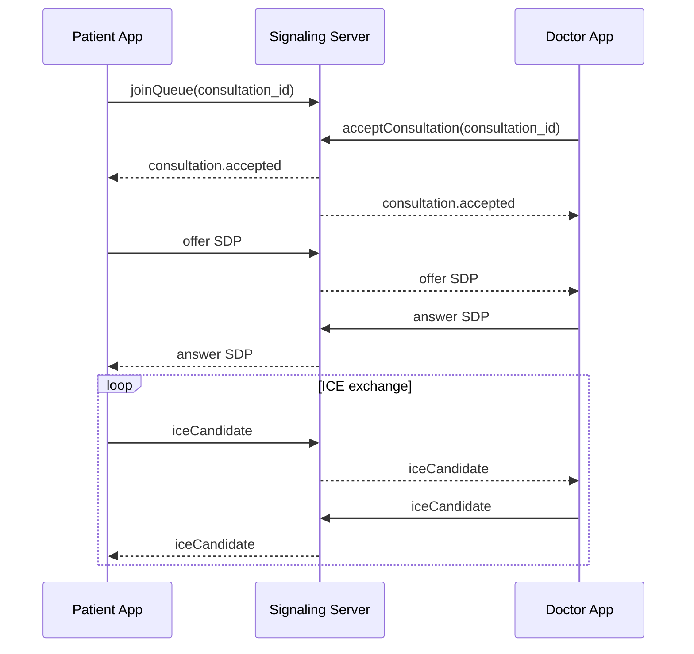

# HealthConnect - Complete Ecosystem Documentation

**Version:** 12.0 (Ultimate Edition)  
**Last Updated:** November 9, 2025  
**Prepared By:** HealthConnect Development Team  
**Status:** Production-Ready

---

# EXECUTIVE SUMMARY

HealthConnect is a comprehensive telemedicine ecosystem designed specifically for Ghana and Sub-Saharan Africa. The platform connects patients with healthcare providers through mobile applications, web dashboards, and desktop software, with special emphasis on:

- **Rural Accessibility**: Twi language support, low-bandwidth optimization, SMS fallback
- **Offline-First Architecture**: Full functionality without internet connectivity
- **Inventory Management**: Real-time drug and lab service tracking
- **Dynamic Geofencing**: Location-based healthcare service discovery
- **Multi-Platform**: Flutter mobile, React web, Electron desktop
- **World-Class Standards**: HIPAA-equivalent compliance, PCI DSS, Ghana Data Protection Act

---

# TABLE OF CONTENTS

## PART 1: SYSTEM OVERVIEW

1. [Executive Summary](#executive-summary)
2. [System Architecture](#system-architecture)
3. [Technology Stack](#technology-stack)
4. [User Roles & Permissions](#user-roles--permissions)

## PART 2: FUNCTIONAL REQUIREMENTS

5. [Patient Features](#patient-features)
6. [Doctor Features](#doctor-features)
7. [Hospital Management Features](#hospital-management-features)
8. [Pharmacy Features](#pharmacy-features)
9. [Laboratory Features](#laboratory-features)

## PART 3: USER JOURNEYS

10. [Patient User Journey](#patient-user-journey)
11. [Doctor User Journey](#doctor-user-journey)
12. [Pharmacy Workflow](#pharmacy-workflow)
13. [Hospital Triage Workflow](#hospital-triage-workflow)

## PART 4: TECHNICAL SPECIFICATIONS

14. [Data Models & Database Schema](#data-models--database-schema)
15. [API Specifications](#api-specifications)
16. [WebRTC Implementation](#webrtc-implementation)
17. [Geofencing Algorithm](#geofencing-algorithm)

## PART 5: INTEGRATION & INVENTORY

18. [Pharmacy Inventory Management](#pharmacy-inventory-management)
19. [Desktop Application](#desktop-application)
20. [API Integration Guide](#api-integration-guide)
21. [Sync Engine & Offline Support](#sync-engine--offline-support)

## PART 6: THIRD-PARTY INTEGRATIONS

22. [Firebase Cloud Messaging](#firebase-cloud-messaging)
23. [Mnotify SMS Integration](#mnotify-sms-integration)
24. [Paystack Payment Integration](#paystack-payment-integration)
25. [Google Maps Integration](#google-maps-integration)

## PART 7: SECURITY & COMPLIANCE

26. [Authentication & Authorization](#authentication--authorization)
27. [Data Encryption](#data-encryption)
28. [Privacy & Compliance](#privacy--compliance)
29. [Security Best Practices](#security-best-practices)

## PART 8: DEPLOYMENT & OPERATIONS

30. [Development Environment Setup](#development-environment-setup)
31. [CI/CD Pipeline](#cicd-pipeline)
32. [Production Deployment](#production-deployment)
33. [Monitoring & Logging](#monitoring--logging)

## PART 9: ADVANCED FEATURES (V10-V12)

34. [AI-Powered Features](#ai-powered-features)
35. [Telemedicine Analytics](#telemedicine-analytics)
36. [Multi-Tenant Architecture](#multi-tenant-architecture)
37. [Blockchain for Records](#blockchain-for-records)

## PART 10: APPENDICES

38. [Troubleshooting Guide](#troubleshooting-guide)
39. [Training Materials](#training-materials)
40. [Support & Maintenance](#support--maintenance)
41. [Glossary](#glossary)

---

# PART 1: SYSTEM OVERVIEW

## 1. System Architecture

### 1.1 High-Level Architecture

```
┌─────────────────────────────────────────────────────────────────────┐
│                    HealthConnect Ecosystem                           │
└─────────────────────────────────────────────────────────────────────┘

┌──────────────────────────────────────────────────────────────────────┐
│                         CLIENT LAYER                                  │
├──────────────────────────────────────────────────────────────────────┤
│                                                                       │
│  ┌─────────────┐  ┌─────────────┐  ┌─────────────┐  ┌────────────┐ │
│  │   Flutter   │  │   Flutter   │  │    React    │  │  Electron  │ │
│  │   Mobile    │  │   Mobile    │  │     Web     │  │  Desktop   │ │
│  │  (Patient)  │  │  (Doctor)   │  │ (Hospital/  │  │ (Pharmacy) │ │
│  │             │  │             │  │  Pharmacy)  │  │            │ │
│  └──────┬──────┘  └──────┬──────┘  └──────┬──────┘  └──────┬─────┘ │
│         │                │                │                │        │
└─────────┼────────────────┼────────────────┼────────────────┼────────┘
          │                │                │                │
          │                └────────┬───────┘                │
          │                         │                        │
┌─────────┼─────────────────────────┼────────────────────────┼────────┐
│         │          API GATEWAY LAYER                       │        │
├─────────┴─────────────────────────┴────────────────────────┴────────┤
│                                                                      │
│  ┌────────────────────────────────────────────────────────────────┐ │
│  │   API Gateway (Kong / AWS API Gateway)                        │ │
│  │   - Authentication & Authorization                            │ │
│  │   - Rate Limiting                                             │ │
│  │   - Load Balancing                                            │ │
│  │   - Request Routing                                           │ │
│  └────────────────────────────────────────────────────────────────┘ │
│                                                                      │
└──────────────────────────────────┬───────────────────────────────────┘
                                   │
┌──────────────────────────────────┴───────────────────────────────────┐
│                      MICROSERVICES LAYER                              │
├───────────────────────────────────────────────────────────────────────┤
│                                                                       │
│  ┌────────────┐  ┌────────────┐  ┌────────────┐  ┌─────────────┐   │
│  │   User     │  │Consultation│  │  Payment   │  │  Notification│   │
│  │  Service   │  │  Service   │  │  Service   │  │   Service    │   │
│  └────────────┘  └────────────┘  └────────────┘  └─────────────┘   │
│                                                                       │
│  ┌────────────┐  ┌────────────┐  ┌────────────┐  ┌─────────────┐   │
│  │Prescription│  │  Lab Test  │  │ Inventory  │  │  Location   │   │
│  │  Service   │  │  Service   │  │  Service   │  │   Service   │   │
│  └────────────┘  └────────────┘  └────────────┘  └─────────────┘   │
│                                                                       │
│  ┌────────────┐  ┌────────────┐  ┌────────────┐  ┌─────────────┐   │
│  │   Queue    │  │   WebRTC   │  │ Analytics  │  │    AI/ML    │   │
│  │  Service   │  │ Signaling  │  │  Service   │  │   Service   │   │
│  └────────────┘  └────────────┘  └────────────┘  └─────────────┘   │
│                                                                       │
└──────────────────────────────────┬───────────────────────────────────┘
                                   │
┌──────────────────────────────────┴───────────────────────────────────┐
│                        DATA LAYER                                     │
├───────────────────────────────────────────────────────────────────────┤
│                                                                       │
│  ┌────────────┐  ┌────────────┐  ┌────────────┐  ┌─────────────┐   │
│  │ PostgreSQL │  │  MongoDB   │  │   Redis    │  │Elasticsearch│   │
│  │ (Primary)  │  │ (Logs,     │  │  (Cache,   │  │  (Search)   │   │
│  │            │  │Transcripts)│  │   Queue)   │  │             │   │
│  └────────────┘  └────────────┘  └────────────┘  └─────────────┘   │
│                                                                       │
│  ┌────────────────────────────────────────────────────────────────┐  │
│  │   AWS S3 / Google Cloud Storage                                │  │
│  │   (Files, Images, Call Recordings, Backups)                    │  │
│  └────────────────────────────────────────────────────────────────┘  │
│                                                                       │
└───────────────────────────────────────────────────────────────────────┘

┌───────────────────────────────────────────────────────────────────────┐
│                    EXTERNAL SERVICES                                   │
├───────────────────────────────────────────────────────────────────────┤
│                                                                        │
│  ┌────────────┐  ┌────────────┐  ┌────────────┐  ┌─────────────┐    │
│  │ Mnotify    │  │ Paystack   │  │  Firebase  │  │Google Maps  │    │
│  │   (SMS)    │  │ (Payments) │  │    (FCM)   │  │    API      │    │
│  └────────────┘  └────────────┘  └────────────┘  └─────────────┘    │
│                                                                        │
│  ┌────────────┐  ┌────────────┐  ┌────────────┐  ┌─────────────┐    │
│  │   Sentry   │  │  DataDog   │  │    AWS     │  │   Twilio    │    │
│  │  (Errors)  │  │   (APM)    │  │ (Hosting)  │  │  (Backup)   │    │
│  └────────────┘  └────────────┘  └────────────┘  └─────────────┘    │
│                                                                        │
└────────────────────────────────────────────────────────────────────────┘
```

### 1.2 Component Communication

**Synchronous Communication (REST API):**

- Client to API Gateway
- API Gateway to Microservices
- Microservices to Database

**Asynchronous Communication (Message Queue):**

- Service-to-Service events (RabbitMQ/Redis Pub/Sub)
- Background job processing (Bull Queue)
- Notification distribution

**Real-Time Communication:**

- WebSocket (Socket.io) for live updates
- WebRTC for voice/video calls
- Server-Sent Events (SSE) for notifications

---

## 2. Technology Stack

### 2.1 Frontend Technologies

#### **Mobile Applications (iOS & Android)**

```yaml
Framework: Flutter 3.16+
Language: Dart 3.2+
State Management: Riverpod 2.4+
UI Components: Material Design 3

Key Packages:
  - flutter_webrtc: ^0.9.48 # Voice/Video calls
  - google_maps_flutter: ^2.5.0 # Maps integration
  - firebase_messaging: ^14.7.0 # Push notifications
  - dio: ^5.4.0 # HTTP client
  - sqflite: ^2.3.0 # Local database
  - flutter_secure_storage: ^9.0.0 # Secure storage
  - socket_io_client: ^2.0.3 # Real-time updates
  - camera: ^0.10.5 # Camera access
  - image_picker: ^1.0.7 # Image selection
  - file_picker: ^6.1.1 # File selection
  - geolocator: ^10.1.0 # Location services
  - permission_handler: ^11.1.0 # Permissions
  - flutter_local_notifications: ^16 # Local notifications
  - path_provider: ^2.1.1 # File paths
  - share_plus: ^7.2.1 # Sharing
  - url_launcher: ^6.2.2 # URLs/Phone calls
  - pdf: ^3.10.7 # PDF generation
  - printing: ^5.11.1 # Printing
  - intl: ^0.18.1 # Internationalization
  - easy_localization: ^3.0.3 # Localization
  - cached_network_image: ^3.3.1 # Image caching
  - shimmer: ^3.0.0 # Loading effects
  - lottie: ^2.7.0 # Animations
  - flutter_rating_bar: ^4.0.1 # Ratings
  - sentry_flutter: ^7.14.0 # Error tracking
```

#### **Web Dashboards (Hospitals & Pharmacies)**

```yaml
Framework: React 18.2+ with TypeScript 5.3+
State Management: Zustand 4.4+ / Redux Toolkit 2.0+
UI Library: Material-UI (MUI) 5.15+ / Ant Design 5.12+
Build Tool: Vite 5.0+

Key Libraries:
  - react-router-dom: ^6.20.0        # Routing
  - axios: ^1.6.0                    # HTTP client
  - socket.io-client: ^4.6.0         # Real-time updates
  - react-query: ^3.39.0             # Data fetching
  - react-hook-form: ^7.49.0         # Forms
  - yup: ^1.3.0                      # Validation
  - @react-google-maps/api: ^2.19.0  # Maps
  - recharts: ^2.10.0                # Charts
  - date-fns: ^2.30.0                # Date utilities
  - react-toastify: ^9.1.0           # Notifications
  - jwt-decode: ^4.0.0               # JWT handling
  - @mui/x-data-grid: ^6.18.0        # Data tables
  - @mui/x-date-pickers: ^6.18.0     # Date pickers
```

#### **Desktop Application (Pharmacy Inventory)**

```yaml
Framework: Electron 28+ with React 18+ & TypeScript
Database: SQLite (better-sqlite3)
Build: electron-builder

Key Dependencies:
  - electron: ^28.0.0
  - electron-updater: ^6.1.0 # Auto-updates
  - better-sqlite3: ^9.2.0 # Local DB
  - electron-store: ^8.1.0 # Settings storage
  - node-fetch: ^3.3.0 # HTTP requests
  - socket.io-client: ^4.6.0 # Real-time sync
  - aws-sdk: ^2.1500.0 # Cloud backup
  - archiver: ^6.0.0 # Backup compression
  - electron-log: ^5.0.0 # Logging
```

### 2.2 Backend Technologies

```yaml
API Server: Node.js 20 LTS with NestJS 10+
Language: TypeScript 5.3+
API Documentation: Swagger/OpenAPI 3.0

Microservices:
  - NestJS: Main API server
  - FastAPI (Python): AI/ML service for triage
  - Node.js + Socket.io: WebRTC signaling server

Key Packages:
  - @nestjs/core: ^10.0.0
  - @nestjs/typeorm: ^10.0.0
  - @nestjs/jwt: ^10.2.0
  - @nestjs/passport: ^10.0.0
  - @nestjs/websockets: ^10.0.0
  - @nestjs/microservices: ^10.0.0
  - typeorm: ^0.3.17                 # ORM
  - pg: ^8.11.0                      # PostgreSQL driver
  - mongodb: ^6.3.0                  # MongoDB driver
  - redis: ^4.6.0                    # Redis client
  - ioredis: ^5.3.0                  # Redis (advanced)
  - bull: ^4.12.0                    # Job queue
  - socket.io: ^4.6.0                # WebSocket
  - bcrypt: ^5.1.0                   # Password hashing
  - jsonwebtoken: ^9.0.2             # JWT
  - passport: ^0.7.0                 # Authentication
  - passport-jwt: ^4.0.1             # JWT strategy
  - class-validator: ^0.14.0         # Validation
  - class-transformer: ^0.5.1        # Transformation
  - helmet: ^7.1.0                   # Security headers
  - compression: ^1.7.4              # Gzip compression
  - winston: ^3.11.0                 # Logging
  - @sentry/node: ^7.91.0            # Error tracking
  - aws-sdk: ^2.1500.0               # AWS services
```

### 2.3 Database & Storage

```yaml
Primary Database: PostgreSQL 15+
  - Extensions: PostGIS (geospatial), TimescaleDB (time-series)
  - Connection Pooling: pgBouncer
  - Replication: Master-Slave (read replicas)

Document Store: MongoDB 6+
  - Use Cases: Logs, transcripts, analytics data
  - Indexing: Text search, geospatial queries

Cache & Queue: Redis 7+
  - Use Cases: Session storage, queue management, pub/sub
  - Configuration: Cluster mode for high availability

Search Engine: Elasticsearch 8+ (Optional)
  - Use Cases: Full-text search, analytics
  - Alternative: PostgreSQL Full-Text Search

Object Storage: AWS S3 / Google Cloud Storage
  - Use Cases: Profile photos, call recordings, prescriptions,
              lab reports, backups
  - CDN: CloudFlare for fast delivery
```

### 2.4 Infrastructure & DevOps

```yaml
Cloud Provider: AWS / Google Cloud / DigitalOcean
Containerization: Docker 24+
Orchestration: Kubernetes 1.28+ (Production) / Docker Compose (Dev)
CI/CD: GitHub Actions / GitLab CI
Monitoring: DataDog / New Relic / Grafana + Prometheus
Logging: ELK Stack (Elasticsearch, Logstash, Kibana)
Error Tracking: Sentry
Backup: Automated daily backups to S3
Load Balancer: Nginx / AWS ALB
SSL: Let's Encrypt (auto-renewal)
```

---

## 3. User Roles & Permissions

### 3.1 Role Definitions

#### **Patient Role**

**Capabilities:**

- ✅ Register and manage profile
- ✅ Search doctors by specialty, location, rating
- ✅ Request consultations
- ✅ Make payments (Mobile Money, Card)
- ✅ Join queue and track position
- ✅ Participate in voice/video calls
- ✅ Record audio symptoms
- ✅ Receive prescriptions
- ✅ Upload lab results
- ✅ Search for nearby pharmacies/labs
- ✅ View consultation history
- ✅ Rate and review doctors
- ✅ Download medical records
- ✅ Update personal information

**Restrictions:**

- ❌ Cannot access doctor dashboard
- ❌ Cannot view other patients' data
- ❌ Cannot modify prescription details
- ❌ Cannot skip payment
- ❌ Cannot access admin functions

#### **Doctor Role**

**Capabilities:**

- ✅ Register with license verification
- ✅ Set availability schedule
- ✅ Go online/offline
- ✅ View patient queue
- ✅ Accept/reject consultation requests
- ✅ Conduct voice/video consultations
- ✅ Access patient info during active consultation
- ✅ Take consultation notes
- ✅ Create prescriptions
- ✅ Upload stamped prescriptions
- ✅ Send lab test requests
- ✅ Share pharmacy/lab locations
- ✅ Provide post-consultation instructions
- ✅ Make referrals (hospital, specialist)
- ✅ Review lab results
- ✅ View consultation history
- ✅ Access earnings dashboard
- ✅ Manage payout settings
- ✅ Take breaks
- ✅ View patient ratings

**Restrictions:**

- ❌ Cannot access other doctors' consultations
- ❌ Cannot modify patient personal data
- ❌ Cannot process payments directly
- ❌ Cannot access patient data outside consultation
- ❌ Cannot delete consultation records

#### **Hospital Management Role**

**Capabilities:**

- ✅ Receive incoming patient requests
- ✅ Perform triage assessment
- ✅ Assign urgency levels
- ✅ Route to appropriate doctors/specialists
- ✅ Determine if suitable for telemedicine
- ✅ View hospital queue status
- ✅ Generate reports
- ✅ Manage hospital staff accounts
- ✅ Configure hospital settings

**Restrictions:**

- ❌ Cannot conduct consultations
- ❌ Cannot access detailed medical records without authorization
- ❌ Cannot modify doctor schedules
- ❌ Cannot process prescriptions

#### **Pharmacy Role**

**Capabilities:**

- ✅ Manage drug inventory
- ✅ Add/edit/delete drugs
- ✅ Track stock levels
- ✅ Set reorder points
- ✅ Receive prescriptions from doctors
- ✅ Update prescription fulfillment status
- ✅ Send pickup notifications
- ✅ Generate reports (sales, inventory, expiry)
- ✅ Manage staff accounts
- ✅ Sync inventory with HealthConnect
- ✅ Operate offline with auto-sync
- ✅ Create backups

**Restrictions:**

- ❌ Cannot modify prescriptions
- ❌ Cannot access patient medical history
- ❌ Cannot conduct consultations
- ❌ Cannot view other pharmacies' data

#### **Laboratory Role**

**Capabilities:**

- ✅ Manage lab services catalog
- ✅ Set service availability
- ✅ Receive lab test requests
- ✅ Upload test results
- ✅ Notify patients/doctors of results
- ✅ Generate reports
- ✅ Manage staff accounts

**Restrictions:**

- ❌ Cannot modify test requests
- ❌ Cannot access full medical history
- ❌ Cannot conduct consultations

#### **Administrator Role**

**Capabilities:**

- ✅ Manage all user accounts
- ✅ Verify doctor credentials
- ✅ Approve/reject registrations
- ✅ Monitor system performance
- ✅ Access analytics and reports
- ✅ Manage payments and disputes
- ✅ Configure system settings
- ✅ Moderate content and reviews
- ✅ Handle support tickets
- ✅ View audit logs
- ✅ Manage integrations
- ✅ Control feature flags

---

# PART 2: FUNCTIONAL REQUIREMENTS

## 4. Patient Features

### FR-P1: User Registration & Authentication

**FR-P1.1: Registration**

- Collect: Full name, date of birth, gender, phone number, email (optional)
- Region/district selection (dropdown)
- Emergency contact details
- Password creation (min 8 chars, complexity requirements)
- Phone verification via OTP (Mnotify SMS)
- Optional: National ID verification
- Language preference (Twi/English)
- Terms & conditions acceptance
- Privacy policy acceptance

**FR-P1.2: Login**

- Phone number or email login
- Password authentication
- Biometric authentication (fingerprint/Face ID)
- "Remember me" option
- Forgot password recovery (SMS OTP)
- Multi-device support
- Session timeout (30 minutes inactivity)

**FR-P1.3: Profile Management**

- View and edit personal information
- Upload profile photo
- Add medical history (allergies, chronic conditions)
- Add insurance information
- Update emergency contact
- Change password
- Manage notification preferences
- Delete account (with confirmation)

### FR-P2: Doctor Discovery

**FR-P2.1: Browse Doctors**

- List view of available doctors
- Grid/card view option
- Doctor profile preview (photo, name, specialty, rating, fee)
- Pagination (20 per page)
- Pull-to-refresh

**FR-P2.2: Search & Filter**

```
Search by:
  - Name
  - Specialty
  - Hospital affiliation

Filter by:
  - Specialty (dropdown: General, Pediatrics, Cardiology, etc.)
  - Availability (Online Now, Available Today, All)
  - Price range (slider: GHS 0-500)
  - Rating (4+ stars, 3+ stars, All)
  - Distance (Nearest, Within 5km, 10km, 20km, All)
  - Language spoken (English, Twi, Ga, etc.)
  - Gender preference

Sort by:
  - Recommended (algorithm-based)
  - Lowest price
  - Highest rated
  - Shortest wait time
  - Nearest location
  - Most experienced (years)
```

**FR-P2.3: Doctor Profile View**

```
Display:
  - Profile photo and name
  - Specialty and sub-specialty
  - Qualifications and certificates
  - Years of experience
  - Hospital/clinic affiliation
  - Rating (stars) and review count
  - Consultation fee (GHS)
  - Current status (Online/Offline/Busy)
  - Queue length (X patients waiting)
  - Estimated wait time (minutes)
  - Languages spoken
  - Professional bio (max 500 chars)
  - Reviews section (expandable, latest 10)
  - Location (if physical practice)
  - Availability hours

Actions:
  - "Consult Now" button (green if available)
  - "View Reviews" button
  - "Share Profile" option
  - "Add to Favorites" option
```

### FR-P3: Consultation Request

**FR-P3.1: Symptom Description**

```
Options:
  1. Text input (max 500 characters)
  2. Voice recording (hold button, max 2 minutes)
  3. Combination of both

Features:
  - Character/time counter
  - Play/pause/delete for audio
  - "Record Again" option
  - Auto-save draft
  - Symptom templates (optional quick selection)

Additional Questions (Optional):
  - How long have you had these symptoms?
  - Pain level (1-10 scale)
  - Is this an emergency?
  - Have you taken any medication?
```

**FR-P3.2: Triage Assessment**

```
System analyzes symptoms for:
  - Emergency keywords (chest pain, difficulty breathing, etc.)
  - Urgency indicators
  - Recommended specialty

Assigns urgency level:
  - Emergency (requires immediate attention)
  - Urgent (within hours)
  - Routine (can wait)

Actions based on urgency:
  - Emergency: Show nearest hospital, offer to call ambulance
  - Urgent: Fast-track in queue
  - Routine: Normal queue process
```

**FR-P3.3: Fee Confirmation**

```
Display:
  - Doctor: Dr. [Name]
  - Specialty: [Specialty]
  - Consultation Fee: GHS [Amount]
  - Platform Fee: GHS [Amount] (if applicable)
  - Total: GHS [Total Amount]

  - Checkbox: "I agree to pay GHS [Total] for this consultation"
  - Refund policy display
  - "Terms & Conditions" link

Buttons:
  - "Proceed to Payment" (primary)
  - "Cancel" (secondary)
```

### FR-P4: Payment Processing

**FR-P4.1: Payment Method Selection**

```
Options:
  1. Mobile Money
     - MTN Mobile Money
     - Vodafone Cash
     - AirtelTigo Money
     - Enter phone number

  2. Card Payment
     - Visa
     - Mastercard
     - Verve
     - Enter card details securely (Paystack)

  3. Wallet (if balance available)
     - Display current balance
     - "Top Up Wallet" option

Features:
  - Save payment method checkbox
  - Security badges (PCI DSS, SSL)
  - Payment amount summary
```

**FR-P4.2: Payment Flow**

```
For Mobile Money:
  1. Enter phone number
  2. Click "Pay Now"
  3. Receive USSD prompt on phone
  4. Approve on phone
  5. Wait for confirmation
  6. Show success message

For Card:
  1. Enter card details
  2. 3D Secure verification
  3. Wait for confirmation
  4. Show success message

On Success:
  - Display receipt with transaction ID
  - Save receipt to consultation history
  - Auto-join queue
  - Send SMS confirmation

On Failure:
  - Show error message
  - Offer to retry
  - Suggest alternative payment method
  - Contact support option
```

### FR-P5: Queue Management

**FR-P5.1: Joining Queue**

```
After successful payment:
  - Patient automatically added to doctor's queue
  - Assigned queue position number
  - Calculate estimated wait time
  - Display queue status screen

Queue Status Screen:
  ┌─────────────────────────────┐
  │  You're in the queue!       │
  │                             │
  │     Position: #3            │
  │     ⚪ ⚪ 🔵 ⚪ ⚪            │
  │                             │
  │  Estimated wait: ~15 min    │
  │                             │
  │  ┌───────────────────────┐  │
  │  │ 👤 Dr. Akosua Boateng│  │
  │  │ General Practitioner  │  │
  │  └───────────────────────┘  │
  │                             │
  │  Waiting since: 10:35 AM    │
  │                             │
  │  [Leave Queue]              │
  └─────────────────────────────┘
```

**FR-P5.2: Real-Time Updates**

```
WebSocket events:
  - Queue position changes
  - Estimated wait time updates
  - Doctor status changes

Push notifications:
  - "You're now #2 in queue"
  - "You're next! Get ready"
  - "Dr. [Name] is ready to call you"

SMS fallback (if app not active):
  - Position updates
  - Ready notification
```

**FR-P5.3: Queue Timeout**

```
When patient reaches front:
  - 3-minute countdown to accept call
  - Notifications at 2:00, 1:00, 0:30 remaining
  - Visual countdown timer
  - Sound alert (if enabled)
  - Vibration

If timeout occurs:
  - Patient removed from queue
  - Consultation fee held for 24 hours
  - Can rejoin queue without repayment within 24 hours
  - After 24 hours, must pay again

Notification:
  "You missed the call from Dr. [Name]. You can rejoin
   the queue within 24 hours without additional payment."

Actions:
  - [Rejoin Queue Now]
  - [Request Refund]
  - [Reschedule]
```

**FR-P5.4: Leave Queue**

```
Patient can voluntarily leave queue:
  - Confirmation dialog: "Are you sure?"
  - Refund policy information

Refund rules:
  - Before consultation starts: 100% refund
  - After call connects: No refund
  - Technical issues: Case-by-case review

Process:
  1. Show refund amount
  2. Confirm leave queue
  3. Remove from queue
  4. Process refund (2-5 business days)
  5. Send confirmation
```

### FR-P6: Voice/Video Consultation

**FR-P6.1: Incoming Call**

```
Full-screen call notification:
  ┌─────────────────────────────┐
  │                             │
  │      👤 [Photo]             │
  │  Dr. Akosua Boateng         │
  │   is calling you...         │
  │                             │
  │   🟢 [Accept]  🔴 [Decline] │
  │                             │
  └─────────────────────────────┘

Features:
  - Large accept/decline buttons
  - Ringtone (customizable)
  - Vibration
  - Show on lock screen
  - Auto-answer disabled (must tap)

Timeout: 30 seconds
  - If missed: Patient can call back
  - Or doctor can retry
```

**FR-P6.2: Voice Call Interface**

```
During voice consultation:
  ┌─────────────────────────────┐
  │   👤 Dr. Akosua Boateng     │
  │   General Practitioner      │
  │                             │
  │        15:23                │
  │   [Audio waveform]          │
  │                             │
  │   🔇    📹    💬            │
  │  Mute  Video  Chat          │
  │                             │
  │   🔊                        │
  │  Speaker                    │
  │                             │
  │     🔴 End Call             │
  └─────────────────────────────┘

Controls:
  - Mute/Unmute microphone
  - Speaker on/off
  - Request video call
  - Text chat (backup communication)
  - End call

Indicators:
  - Call duration timer
  - Network quality (bars or colored dot)
  - Recording indicator (if enabled)
  - Mute status
```

**FR-P6.3: Video Call Request**

```
Patient can request video:
  - Tap "Request Video" button
  - Popup: "Request video call?"
  - Reason (optional):
    "I need to show the doctor [symptom]"

  - [Send Request] or [Cancel]

Waiting for approval:
  - Show "Waiting for doctor's approval..."
  - Spinner animation

If approved:
  - Video camera activates
  - Switch to video call interface
  - Can still return to voice-only

If denied:
  - Message: "Doctor has declined video request."
  - Continue with voice call
```

**FR-P6.4: Video Call Interface**

```
Video call layout:
  ┌─────────────────────────────┐
  │ [Doctor's video - large]    │
  │                             │
  │                             │
  │  ┌─────────┐               │
  │  │ You     │  [Small PIP]  │
  │  └─────────┘               │
  │                             │
  │  🔇 📹 🔄 💬 🔴           │
  └─────────────────────────────┘

Controls:
  - Mute/unmute
  - Turn video on/off
  - Switch camera (front/back)
  - Text chat
  - End call

Features:
  - Picture-in-picture
  - Tap to swap video positions
  - Pinch to zoom (your video)
  - Network quality indicator
  - Auto-switch to audio if connection poor
```

**FR-P6.5: Call Quality Management**

```
Network monitoring:
  - Detect connection quality
  - Show indicators (Good/Fair/Poor)

Poor connection actions:
  - Reduce video quality automatically
  - Suggest switching to audio-only
  - Show "Reconnecting..." message
  - Buffer audio to prevent gaps

Call reconnection:
  - If disconnected < 30 seconds: auto-reconnect
  - Show "Call disconnected. Reconnecting..."
  - If > 30 seconds: manual reconnect option
  - Notify both parties
```

### FR-P7: Prescription Management

**FR-P7.1: Receiving Prescription**

```
Push notification:
  "Dr. [Name] has sent you a prescription"

Prescription screen:
  ┌─────────────────────────────────┐
  │  Prescription                   │
  │  From: Dr. Akosua Boateng       │
  │  Date: 09 Nov 2025, 10:45 AM    │
  │  License: MDC-12345             │
  │                                 │
  │  Patient: Kwame Mensah          │
  │  Age: 35 years                  │
  │                                 │
  │  ──────────────────────────     │
  │                                 │
  │  1. Paracetamol 500mg           │
  │     Dosage: 1 tablet            │
  │     Frequency: 3 times daily    │
  │     Duration: 5 days            │
  │     Instructions: Take after    │
  │     meals with water            │
  │                                 │
  │  2. Vitamin C 1000mg            │
  │     Dosage: 1 tablet            │
  │     Frequency: Once daily       │
  │     Duration: 7 days            │
  │                                 │
  │  ──────────────────────────     │
  │                                 │
  │  Doctor's Signature: [Image]    │
  │  Verification Code: PRX-123456  │
  │                                 │
  │  [Download PDF]                 │
  │  [Find Pharmacy]                │
  │  [Share]                        │
  └─────────────────────────────────┘
```

**FR-P7.2: Download Prescription**

```
Actions:
  - Generate PDF with prescription details
  - Include doctor's stamp/signature
  - Watermark with verification code
  - Save to device storage
  - Option to print (if printer available)

PDF contents:
  - HealthConnect letterhead
  - Date and time
  - Doctor's details and license
  - Patient details
  - Complete medication list with instructions
  - Doctor's signature
  - QR code for verification
```

**FR-P7.3: Find Pharmacy**

```
When tapping "Find Pharmacy":
  - Use geofencing algorithm
  - Search pharmacies within 10km
  - Check drug availability in inventory
  - Display results on map

Results screen:
  - Map view with pharmacy pins
  - Toggle to list view
  - Each result shows:
    * Pharmacy name
    * Distance (e.g., "2.5 km away")
    * Travel time (e.g., "8 minutes")
    * Drug availability (✓ or ✗)
    * Prices
    * Rating
    * Open/Closed status
    * Phone number

Actions per pharmacy:
  - [Navigate] (opens Google Maps)
  - [Call]
  - [Send Prescription] (if integrated)
```

### FR-P8: Lab Results Management

**FR-P8.1: Upload Lab Results**

```
Access from:
  - Home screen: "Upload Lab Results"
  - Consultation history: specific consultation

Upload screen:
  ┌─────────────────────────────────┐
  │  Upload Lab Results             │
  │                                 │
  │  Select consultation:           │
  │  [Dropdown: Recent consultations]│
  │                                 │
  │  Upload files:                  │
  │  ┌─────────────────────────┐   │
  │  │  📷 Take Photo          │   │
  │  └─────────────────────────┘   │
  │  ┌─────────────────────────┐   │
  │  │  🖼️ Choose from Gallery│   │
  │  └─────────────────────────┘   │
  │  ┌─────────────────────────┐   │
  │  │  📄 Select Document     │   │
  │  └─────────────────────────┘   │
  │                                 │
  │  Selected files:                │
  │  • Lab_Report_1.jpg [X]         │
  │  • Blood_Test.pdf [X]           │
  │                                 │
  │  Notes (optional):              │
  │  [Text area]                    │
  │                                 │
  │  [Upload Results]               │
  └─────────────────────────────────┘

Features:
  - Multiple file selection
  - Support: JPG, PNG, PDF
  - Max 10 files per upload
  - Max 10MB per file
  - Preview before upload
  - Progress indicator
  - Compress large images automatically
```

**FR-P8.2: View Lab Results**

```
Lab results list:
  - Sorted by date (newest first)
  - Show thumbnail preview
  - Consultation linked
  - Doctor review status

Individual result view:
  - Full-screen image viewer
  - Pinch to zoom
  - Swipe between images
  - Download option
  - Share option
  - Delete option (with confirmation)

Doctor's comments (if available):
  - Notification: "Dr. [Name] reviewed your results"
  - Display comments
  - Recommended actions
  - Follow-up needed indicator
```

### FR-P9: Consultation History

**FR-P9.1: History List**

```
List view:
  ┌─────────────────────────────────┐
  │  Consultations                  │
  │  [Filter ▼] [Search 🔍]        │
  │                                 │
  │  ┌───────────────────────────┐ │
  │  │ 09 Nov 2025, 10:30 AM     │ │
  │  │ Dr. Akosua Boateng        │ │
  │  │ General Practitioner      │ │
  │  │ Duration: 15 min          │ │
  │  │ Status: Completed ✓       │ │
  │  └───────────────────────────┘ │
  │                                 │
  │  ┌───────────────────────────┐ │
  │  │ 05 Nov 2025, 02:15 PM     │ │
  │  │ Dr. Kofi Adjei            │ │
  │  │ Pediatrics                │ │
  │  │ Duration: 20 min          │ │
  │  │ Status: Completed ✓       │ │
  │  └───────────────────────────┘ │
  │                                 │
  │  [Load More]                    │
  └─────────────────────────────────┘

Filters:
  - All consultations
  - Last 7 days
  - Last 30 days
  - Last 6 months
  - By doctor
  - By specialty
  - By status (completed, cancelled)

Search:
  - By doctor name
  - By symptoms
  - By date range
```

**FR-P9.2: Consultation Details**

```
Detailed view:
  ┌─────────────────────────────────┐
  │  Consultation Summary           │
  │  ────────────────────────────   │
  │                                 │
  │  Date: 09 Nov 2025              │
  │  Time: 10:30 AM - 10:45 AM      │
  │  Duration: 15 minutes           │
  │                                 │
  │  Doctor                         │
  │  👤 Dr. Akosua Boateng          │
  │  General Practitioner           │
  │  License: MDC-12345             │
  │                                 │
  │  Chief Complaint                │
  │  "Headaches for 3 days..."      │
  │                                 │
  │  Diagnosis                      │
  │  Tension headache               │
  │                                 │
  │  Prescriptions (2)              │
  │  • Paracetamol 500mg            │
  │  • Vitamin C 1000mg             │
  │  [View Prescription]            │
  │                                 │
  │  Lab Tests                      │
  │  No lab tests requested         │
  │                                 │
  │  Instructions                   │
  │  "Get adequate rest, stay       │
  │  hydrated, avoid stress..."     │
  │                                 │
  │  Follow-up                      │
  │  Recommended in 1 week if       │
  │  symptoms persist               │
  │                                 │
  │  Payment                        │
  │  Amount: GHS 50.00              │
  │  Status: Paid ✓                 │
  │  Transaction ID: TXN-123456     │
  │                                 │
  │  [Download Summary]             │
  │  [Rate Consultation]            │
  │  [Book Follow-up]               │
  └─────────────────────────────────┘
```

### FR-P10: Emergency Consultation

**FR-P10.1: Emergency Button**

```
Persistent red button on home screen:
  🚨 EMERGENCY

When tapped:
  ┌─────────────────────────────────┐
  │  ⚠️ Emergency                   │
  │                                 │
  │  Is this a life-threatening     │
  │  emergency?                     │
  │                                 │
  │  For severe emergencies like:   │
  │  • Chest pain                   │
  │  • Difficulty breathing         │
  │  • Severe bleeding              │
  │  • Loss of consciousness        │
  │  • Stroke symptoms              │
  │                                 │
  │  Please call emergency services │
  │  immediately.                   │
  │                                 │
  │  [Call 112/193] (Emergency)     │
  │  [Yes, Get Doctor Now] (Urgent) │
  │  [No, Regular Consultation]     │
  └─────────────────────────────────┘
```

**FR-P10.2: Emergency Flow**

```
If "Get Doctor Now" selected:
  1. Simplified symptom entry
     - Pre-filled emergency categories
     - Quick voice recording

  2. Automatic triage
     - AI analyzes urgency
     - Assigns emergency level

  3. If truly emergency:
     - Show nearest hospital on map
     - Distance and directions
     - Hospital phone number
     - [Navigate to Hospital]
     - [Call Hospital]
     - Simultaneously connect to on-call doctor

  4. If urgent but not emergency:
     - Skip queue (priority 1)
     - Connect to available doctor immediately
     - Video call enabled by default
     - Payment charged after (or from wallet)

  5. First available doctor notified
     - Push notification with sound
     - SMS backup
     - Call connects within 30 seconds
     - If no answer, route to next doctor
```

### FR-P11: Notifications

**FR-P11.1: Notification Types**

```
In-App Notifications:
  - Queue position updates
  - Incoming call alerts
  - Prescription ready
  - Lab results uploaded
  - Doctor response
  - Payment confirmations
  - Appointment reminders

Push Notifications (FCM):
  - All above types
  - Can be received when app closed
  - Customizable per type

SMS Notifications (Mnotify):
  - Fallback for critical notifications
  - Payment confirmations
  - Queue ready alerts
  - Appointment reminders
```

**FR-P11.2: Notification Settings**

```
Settings screen:
  ┌─────────────────────────────────┐
  │  Notification Preferences       │
  │                                 │
  │  Push Notifications      [ON]   │
  │                                 │
  │  Queue Updates           [ON]   │
  │  Call Alerts             [ON]   │
  │  Prescriptions           [ON]   │
  │  Lab Results             [ON]   │
  │  Payment                 [ON]   │
  │  Reminders               [ON]   │
  │  Promotional             [OFF]  │
  │                                 │
  │  SMS Notifications       [ON]   │
  │  Critical only           [ON]   │
  │                                 │
  │  Notification Sound      [ON]   │
  │  Choose Sound            [...]  │
  │  Vibration               [ON]   │
  │                                 │
  │  Do Not Disturb                 │
  │  From: [09:00 PM]               │
  │  To:   [07:00 AM]               │
  │  [ON]                           │
  └─────────────────────────────────┘
```

### FR-P12: Ratings & Reviews

**FR-P12.1: Rate Doctor**

```
After consultation ends:
  ┌─────────────────────────────────┐
  │  Rate Your Experience           │
  │                                 │
  │  Dr. Akosua Boateng             │
  │                                 │
  │  Overall Rating:                │
  │  ⭐ ⭐ ⭐ ⭐ ⭐                    │
  │                                 │
  │  Professionalism:               │
  │  ⭐ ⭐ ⭐ ⭐ ⭐                    │
  │                                 │
  │  Communication:                 │
  │  ⭐ ⭐ ⭐ ⭐ ⭐                    │
  │                                 │
  │  Helpfulness:                   │
  │  ⭐ ⭐ ⭐ ⭐ ⭐                    │
  │                                 │
  │  Write a review (optional):     │
  │  ┌─────────────────────────┐   │
  │  │                         │   │
  │  └─────────────────────────┘   │
  │                                 │
  │  ☐ Submit anonymously           │
  │                                 │
  │  [Submit Review]                │
  │  [Skip]                         │
  └─────────────────────────────────┘

Validation:
  - At least overall rating required
  - Review text optional (max 500 chars)
  - Can only rate once per consultation
  - Can edit rating within 24 hours
```

**FR-P12.2: View Doctor Reviews**

```
On doctor profile:
  - Average rating (stars)
  - Total review count
  - Rating breakdown:
    * 5 stars: [Progress bar] (60%)
    * 4 stars: [Progress bar] (25%)
    * 3 stars: [Progress bar] (10%)
    * 2 stars: [Progress bar] (3%)
    * 1 star:  [Progress bar] (2%)

Individual reviews:
  - Reviewer name or "Anonymous"
  - Date
  - Star rating
  - Review text
  - Doctor's response (if any)

Sort by:
  - Most recent
  - Highest rated
  - Lowest rated
  - Most helpful

Filter by:
  - Rating (5 stars, 4+, 3+, etc.)
  - Time period
```

---

## 5. Doctor Features

### FR-D1: Doctor Registration

**FR-D1.1: Registration Form**

```
Step 1: Personal Information
  - Full name (as on license)
  - Date of birth
  - Gender
  - Phone number
  - Email address (required)
  - Create password
  - Confirm password

Step 2: Professional Information
  - Medical license number
  - Issuing authority (dropdown: Ghana Med & Dental Council)
  - Specialty (searchable dropdown)
  - Sub-specialty (optional)
  - Years of experience
  - Current hospital/clinic (optional)
  - Additional qualifications (text area)
  - Professional bio (max 500 chars)

Step 3: Document Upload
  - Medical license (PDF/Image, required)
  - Professional ID (PDF/Image, required)
  - Qualification certificates (multiple, optional)
  - Recent passport photo (required)

Step 4: Consultation Settings
  - Consultation fee (GHS, min 20, max 500)
  - Average consultation duration (15/30/45/60 min)
  - Languages spoken (checkboxes)
  - Specialties you handle
  - Maximum patients per day (optional)

Step 5: Payment Information
  - Bank name (dropdown)
  - Account number
  - Account name
  - Branch (optional)
  - Mobile Money number (alternative)
  - Tax ID (if applicable)

Step 6: Availability Schedule
  - Set working days (checkboxes: Mon-Sun)
  - Set hours for each day
  - Add break times
  - Set recurring schedule

Step 7: Review & Submit
  - Review all information
  - Accept terms & conditions
  - Accept privacy policy
  - Submit for verification
```

**FR-D1.2: Verification Process**

```
After submission:
  1. Email confirmation sent
  2. Admin review (24-48 hours)
  3. License verification with Med Council
  4. Document review
  5. Approval or request for corrections
  6. Account activation
  7. Welcome email with login details

Status screen:
  ┌─────────────────────────────────┐
  │  Application Status             │
  │                                 │
  │  ✓ Application submitted        │
  │  ⏳ Document verification       │
  │  ⏳ License verification        │
  │  ⏳ Admin approval              │
  │  ⬜ Account activation          │
  │                                 │
  │  Estimated completion:          │
  │  Within 48 hours                │
  │                                 │
  │  [Check Status]                 │
  └─────────────────────────────────┘
```

### FR-D2: Doctor Dashboard

**FR-D2.1: Home Dashboard**

```
  ┌─────────────────────────────────┐
  │  Dashboard                      │
  │  Dr. Akosua Boateng             │
  │                                 │
  │  Status: [ONLINE ▼]             │
  │  • Available                    │
  │  • Busy                         │
  │  • On Break                     │
  │  • Offline                      │
  │                                 │
  │  Today's Statistics             │
  │  ┌─────┬─────┬─────┬─────┐     │
  │  │ 12  │GHS  │ 4.8 │ 8   │     │
  │  │Cons.│750  │Rate │Queue│     │
  │  └─────┴─────┴─────┴─────┘     │
  │                                 │
  │  Quick Actions                  │
  │  [View Queue] [Take Break]      │
  │  [Earnings]   [Settings]        │
  │                                 │
  │  Pending Reviews                │
  │  • 3 lab results to review      │
  │  • 2 follow-up requests         │
  │                                 │
  │  Schedule Today                 │
  │  09:00 AM - 05:00 PM            │
  │  Break: 12:00 PM - 01:00 PM     │
  │                                 │
  │  Recent Consultations           │
  │  [List of last 5]               │
  └─────────────────────────────────┘
```

### FR-D3: Queue Management

**FR-D3.1: Queue View**

```
  ┌─────────────────────────────────┐
  │  Patient Queue (8)              │
  │  [Sort ▼] [Filter ▼]           │
  │                                 │
  │  🔴 EMERGENCY (1)               │
  │  ┌───────────────────────────┐ │
  │  │ Kwame M., 45, Male        │ │
  │  │ "Severe chest pain..."    │ │
  │  │ Wait: 2 min               │ │
  │  │ [CALL NOW]                │ │
  │  └───────────────────────────┘ │
  │                                 │
  │  🟠 URGENT (2)                  │
  │  ┌───────────────────────────┐ │
  │  │ Ama A., 28, Female        │ │
  │  │ "High fever for 3 days"   │ │
  │  │ Wait: 15 min | 💰 Paid    │ │
  │  │ [View] [Call] [Skip]      │ │
  │  └───────────────────────────┘ │
  │                                 │
  │  🟢 ROUTINE (5)                 │
  │  ┌───────────────────────────┐ │
  │  │ Kofi B., 35, Male         │ │
  │  │ "Headache for 2 days"     │ │
  │  │ Wait: 25 min | 💰 Paid    │ │
  │  │ [View] [Call] [Skip]      │ │
  │  └───────────────────────────┘ │
  │                                 │
  │  [More Patients...]             │
  └─────────────────────────────────┘

Features:
  - Color-coded by urgency
  - Sort by: Wait time, Urgency, Payment status
  - Filter by: Paid, Symptoms, Age range
  - Pull to refresh
  - Real-time updates
```

**FR-D3.2: Patient Details (Before Call)**

```
Tap "View" on patient card:
  ┌─────────────────────────────────┐
  │  Patient Information            │
  │                                 │
  │  Name: Kwame Mensah             │
  │  Age: 35 years                  │
  │  Gender: Male                   │
  │                                 │
  │  Chief Complaint:               │
  │  "I have been experiencing      │
  │   severe headaches for the      │
  │   past 3 days..."               │
  │                                 │
  │  [🔊 Play Audio]                │
  │                                 │
  │  Urgency: Routine               │
  │  Wait Time: 25 minutes          │
  │  Payment: Paid ✓                │
  │                                 │
  │  Medical History:               │
  │  • Hypertension (controlled)    │
  │  • No known allergies           │
  │                                 │
  │  Previous Consultations: 2      │
  │  Last visit: 3 months ago       │
  │                                 │
  │  [Call Patient]                 │
  │  [Skip to Bottom]               │
  │  [Reject (Refund)]              │
  └─────────────────────────────────┘
```

### FR-D4: Conducting Consultation

**FR-D4.1: Initiating Call**

```
When doctor taps "Call Patient":
  1. System notifies patient
  2. Patient has 30 seconds to accept
  3. Show "Calling..." screen

If patient accepts:
  - Call connects
  - Enter consultation interface

If patient doesn't accept:
  ┌─────────────────────────────────┐
  │  Patient Not Responding         │
  │                                 │
  │  Kwame Mensah did not answer    │
  │  the call.                      │
  │                                 │
  │  [Try Again]                    │
  │  [Move to Bottom of Queue]      │
  │  [Remove from Queue (Refund)]   │
  └─────────────────────────────────┘
```

**FR-D4.2: Consultation Interface**

```
  ┌─────────────────────────────────┐
  │  🔴 15:23  Kwame M., 35         │
  │  ──────────────────────────     │
  │                                 │
  │  [Audio waveform visualization] │
  │                                 │
  │  Controls:                      │
  │  🔇 Mute                        │
  │  🔊 Speaker                     │
  │  📹 Request/Grant Video         │
  │  📋 Notes (Quick access)        │
  │  🔴 End Call                    │
  │                                 │
  │  ──────────────────────────     │
  │                                 │
  │  Quick Actions (Sidebar):       │
  │  • 📝 Take Notes                │
  │  • 💊 Create Prescription       │
  │  • 🧪 Request Lab Test          │
  │  • 🏥 Make Referral             │
  │  • 📍 Share Location            │
  │  • 📸 Request Photo             │
  │                                 │
  │  Patient Info:                  │
  │  • Age: 35, Male                │
  │  • Chief Complaint: Headache    │
  │  • History: Hypertension        │
  │  • [View Full History]          │
  └─────────────────────────────────┘

Features:
  - Split screen: Call + Tools
  - Real-time transcription (optional)
  - Call recording indicator
  - Network quality indicator
  - Timer showing duration
```

**FR-D4.3: Taking Notes During Call**

```
Notes panel (collapsible sidebar):
  ┌─────────────────────────────────┐
  │  Consultation Notes             │
  │                                 │
  │  History of Present Illness:    │
  │  [Text area]                    │
  │  🎤 [Voice-to-text]             │
  │                                 │
  │  Physical Examination:          │
  │  [Text area]                    │
  │                                 │
  │  Vital Signs:                   │
  │  BP: [___] / [___] mmHg         │
  │  Temp: [___] °C                 │
  │  Pulse: [___] bpm               │
  │  Weight: [___] kg               │
  │
```

**FR-D4.4: Creating Prescriptions**

```
During or after consultation, doctor can create prescription:
  - Search drug database
  - Select medication
  - Set dosage, frequency, duration
  - Add instructions
  - Generate prescription PDF
  - Send to patient
  - Optional: Send to pharmacy
```

---

## 10. Doctor User Journey - Complete Day

### Dr. Akosua Boateng's Typical Workday

**Context:** Dr. Akosua Boateng, General Practitioner, 10 years experience

**06:30 AM - Morning Routine**

```
1. Dr. Akosua wakes up
2. Checks phone - HealthConnect notification:
   "3 patients already in queue for today"
3. Reviews schedule in app:
   - Start time: 9:00 AM
   - End time: 5:00 PM
   - Lunch break: 12:00-1:00 PM
4. Mentally prepares for day
```

**08:45 AM - Pre-Work Setup**

```
5. Opens HealthConnect Doctor app on tablet
6. Logs in with fingerprint
7. Reviews dashboard:
   - Status: Offline
   - Pending patients: 3
   - Yesterday's stats: 12 consultations, GHS 600 earned
8. Checks pending items:
   - 2 lab results to review
   - 1 follow-up request
9. Reviews first lab result quickly
```

**09:00 AM - Going Online**

```
10. Taps status: Changes from Offline → Available
11. Green indicator shows "Online"
12. Push notification to waiting patients:
    "Dr. Akosua Boateng is now available"
13. Queue updates:
    - Position #1 ready immediately
    - 2 others waiting
14. Takes deep breath - ready to start
```

**09:02 AM - First Patient (Emergency Priority)**

```
15. Queue shows EMERGENCY patient at top
16. Male, 45, "Severe chest pain and shortness of breath"
17. Red warning indicators
18. Dr. Akosua reviews immediately
19. Reads full complaint:
    "I have severe chest pain radiating to my left arm
     for the past 30 minutes. I'm sweating and feel dizzy."
20. AI triage: EMERGENCY - 95% confidence
21. Decision: Immediate hospital visit needed
22. Takes action:
    - Sends patient nearest hospital location (Ridge Hospital, 2.3km)
    - Emergency contact number
    - Advises: "Call ambulance or go immediately"
    - Marks as "Referred to Emergency"
23. Calls patient directly (voice call)
24. Speaks for 3 minutes:
    - Confirms symptoms
    - Advises immediate hospital visit
    - Stays on line until patient confirms transport arranged
25. Documents in system
26. Notifies Ridge Hospital emergency dept
27. Time: 12 minutes total
```

**09:15 AM - Second Patient (Routine)**

```
28. Next patient: Kwame Mensah (the headache case)
29. Reviews complaint:
    - Listens to 1:45 audio recording
    - Headache for 3 days
    - No emergency signs
30. Checks patient info:
    - Age: 35, Male
    - Medical history: None significant
    - Previous consultations: 0 (new patient)
31. Taps "Call Patient"
32. Kwame accepts within 5 seconds
33. 15-minute consultation (as described earlier)
34. During call:
    - Takes notes in sidebar
    - Uses voice-to-text for speed
    - Fills in diagnosis: "Tension headache"
35. Creates prescription:
    - Searches: "Paracetamol"
    - Selects: Paracetamol 500mg tablets
    - Quantity: 20
    - Frequency: 3x daily
    - Duration: 5 days
    - Instructions: "Take after meals with water"
36. Sends prescription to patient
37. Provides verbal instructions
38. Ends call
39. Reviews auto-generated summary
40. Finalizes and sends
41. Time: 18 minutes total (call + admin)
```

**09:35 AM - Third Patient**

```
42. Patient: Female, 28, "High fever and vomiting for 2 days"
43. Marked as URGENT by triage
44. Calls patient
45. 20-minute consultation
46. Diagnosis: Suspected gastroenteritis
47. Orders lab test:
    - Stool test
    - Full blood count
48. Creates lab request form
49. Sends to patient
50. Prescribes:
    - ORS (oral rehydration salts)
    - Antiemetic
51. Advice: Hydration, bland diet
52. Follow-up: After lab results
53. Time: 25 minutes
```

**10:00 AM - Quick Break (Self-Initiated)**

```
54. After 3 patients, feels need for break
55. Taps "Take Break" - 15 minutes
56. Status: On Break
57. Queue pauses (patients keep positions)
58. Uses bathroom
59. Drinks water
60. Stretches
61. Checks personal messages
```

**10:15 AM - Resume Work**

```
62. Break ends automatically
63. Status: Available
64. Queue resumes
65. Notification: "4 patients waiting"
```

**10:15 AM - 12:00 PM - Continuous Consultations**

```
66. Patient 4: Child, 5, fever → Suspected malaria → Test ordered
67. Patient 5: Male, 52, hypertension follow-up → Adjust medication
68. Patient 6: Female, 30, skin rash → Requests video → Approves →
    Diagnoses allergic reaction → Prescribes antihistamine
69. Patient 7: Male, 18, sports injury → Refers to orthopedist
70. Patient 8: Female, 42, diabetes check → Reviews lab results →
    Adjusts insulin dosage

Total: 5 more patients
Time: 1 hour 45 minutes (average 21 min each)
```

**12:00 PM - Lunch Break**

```
71. Taps "On Break"
72. Sets duration: 1 hour
73. Status shows: "On lunch break until 1:00 PM"
74. New patients see: "Doctor on break, back at 1:00 PM"
75. Existing queue preserved
76. Goes to kitchen
77. Eats lunch
78. Relaxes
79. Checks HealthConnect earnings:
    - Morning: 8 patients
    - Earned: GHS 400
    - Pending payout: GHS 1,200
```

**1:00 PM - Afternoon Session Begins**

```
80. Break ends automatically
81. Status: Available
82. Push notification: "6 patients waiting"
83. Resumes consultations
```

**1:00 PM - 5:00 PM - Afternoon Consultations**

```
84. Patients 9-20: Various cases
    - Common cold (2)
    - Stomach pain (1)
    - Headache (1)
    - Cough (2)
    - General check-up (1)
    - Lab result follow-ups (2)
    - Prescription refills (2)
    - Referrals (1)

85. Notable case at 3:30 PM:
    - Patient uploads lab results (from morning)
    - Dr. Akosua reviews immediately
    - Results show anemia
    - Calls patient back (free follow-up call)
    - Prescribes iron supplements
    - Advises diet changes
    - Schedules 1-month follow-up

Total afternoon: 12 patients
Time: 4 hours (average 20 min each)
```

**5:00 PM - End of Scheduled Day**

```
86. Schedule end time reached
87. Still 2 patients in queue
88. Decision time:
    - Option 1: Go offline (patients offered refund/reschedule)
    - Option 2: Finish current queue
89. Dr. Akosua chooses: Finish queue (professional ethics)
90. Completes last 2 patients
91. Time: Extra 40 minutes until 5:40 PM
```

**5:40 PM - Going Offline**

```
92. All patients completed
93. Taps status: Available → Offline
94. Confirmation: "Great work today!"
95. Daily summary shows:
    ┌─────────────────────────────┐
    │ Today's Summary             │
    │                             │
    │ Consultations: 20           │
    │ Total Time: 7h 40min        │
    │ Avg Consultation: 23 min    │
    │                             │
    │ Earnings Today:             │
    │ Gross: GHS 1,000            │
    │ Platform Fee: -GHS 100      │
    │ Net: GHS 900                │
    │                             │
    │ Patient Satisfaction:       │
    │ Avg Rating: 4.9 ⭐          │
    │ Reviews: 15 (5 new)         │
    │                             │
    │ Top Issues:                 │
    │ 1. Headache (4)             │
    │ 2. Fever (3)                │
    │ 3. Stomach issues (3)       │
    └─────────────────────────────┘
```

**6:00 PM - Post-Work Review**

```
96. Reviews pending items:
    - 3 more lab results came in
    - Will review tomorrow morning
97. Checks ratings:
    - Reads new reviews
    - Responds to 2 reviews
98. Reviews earnings:
    - Weekly total: GHS 4,500
    - Pending payout Friday: GHS 4,000
99. Updates schedule for tomorrow:
    - 9:00 AM - 3:00 PM (shorter day)
100. Closes app
101. Satisfied with productive day
```

**Day Summary for Dr. Akosua:**

- **Hours worked:** 7h 40min (including breaks)
- **Patients seen:** 20 (1 emergency, 2 urgent, 17 routine)
- **Average consultation:** 23 minutes
- **Earnings:** GHS 900 net
- **Rating:** 4.9/5.0 average
- **Lab requests sent:** 4
- **Prescriptions created:** 18
- **Referrals made:** 2
- **Follow-up calls:** 1

---

# PART 3: USER JOURNEYS (Detailed)

## 9. Patient User Journey - Complete End-to-End

### Journey Scenario: First-Time User with Headache

**Context:** Kwame Mensah, 35-year-old male in Accra, experiencing headaches for 3 days

**Step 1: Download & Registration (5 minutes)**
```

1. Downloads HealthConnect from Play Store
2. Opens app → Language selection screen
3. Selects "Twi" (default)
4. Views 3-slide intro (swipes through)
5. Taps "Hyɛ aseɛ" (Get Started)
6. Selects "Me yɛ ayarefoɔ" (I'm a patient)
7. Fills registration form:
   - Din: Kwame Mensah
   - Awoda: 15/05/1990
   - Barima/Basia: Barima (Male)
   - Phone: 024 123 4567
   - Email: (skips - optional)
   - Mpɔtam: Greater Accra > Accra Metro
   - Password: Creates strong password
8. Receives OTP: 123456
9. Enters OTP → Account verified
10. Skips optional profile setup
11. Views quick tutorial (4 screens)
12. Arrives at home screen

```

**Step 2: Search for Doctor (2 minutes)**
```

13. Home screen shows: "Akwaaba, Kwame!"
14. Taps large "Hwehwɛ Odɔkotani" (Find Doctor) button
15. Sees list of available doctors
16. Applies filter:
    - Specialty: All
    - Available: Online Now
    - Distance: Within 10km
17. Sorts by: Shortest Wait Time
18. Sees Dr. Akosua Boateng at top:
    - General Practitioner
    - 4.8 ⭐ (150 reviews)
    - GHS 50
    - Online (2 patients waiting)
    - ~10 min wait
19. Taps to view profile
20. Reads bio, checks reviews
21. Taps "Hwehwɛ Seesei" (Consult Now)


**Step 3: Describe Symptoms (3 minutes)**

```
22. Screen prompts: "Ka wo yareɛ ho asɛm" (Describe your illness)
23. Kwame has two options:
24. Chooses voice recording (easier than typing)
25. Holds microphone button
26. Records in Twi: "Me ti yɛ me ya paa. Ɛreyɛ me ya nnansa ni.
    Ɛyɛ me ya berɛ a mesɔre anɔpa ne anadwo."
    (Translation: "I have severe headache. It's been hurting
    for 3 days. It hurts when I wake up in the morning and at night.")
27. Plays back to confirm
28. Satisfied with recording
29. Taps "Kɔ so" (Continue)
```

**Step 4: System Triage (30 seconds)**

```
30. System analyzes symptoms:
    - Detects: "ti yɛ me ya" (headache)
    - Duration: "nnansa" (3 days)
    - No emergency keywords
    - Assigns: Routine urgency
31. System asks additional question:
    "Yareɛ no mu yɛ den? (1-10)"
    (How severe is the pain?)
32. Kwame selects: 6/10
33. System confirms suitable for telemedicine
```

**Step 5: Payment (3 minutes)**

```
34. Fee confirmation screen shows:
    - Odɔkotani: Dr. Akosua Boateng
    - Aboɔdeɛ: GHS 50.00
    - Nyinaa: GHS 50.00
35. Checkbox: "Me pene so sɛ metua GHS 50"
36. Taps "Kɔ tua ka" (Proceed to Payment)
37. Selects payment method: Mobile Money (MTN)
38. Enters: 024 123 4567
39. Taps "Tua Seesei" (Pay Now)
40. Receives MTN prompt: *170#
41. Dials and approves payment
42. Waits 10 seconds
43. Success: "Aboɔdeɛ atua!" (Payment successful!)
44. Receipt displayed with TXN-789012
```

**Step 6: Join Queue (1 minute)**

```
45. Auto-redirected to queue screen
46. Shows: "Wowɔ nhyehyɛeɛ no mu!" (You're in queue!)
47. Position: #3
48. Estimated wait: ~15 minutes
49. Visual: ⚪ ⚪ 🔵 ⚪ ⚪
50. Shows Dr. Akosua's photo and info
51. Timer starts: "Waiting since 10:35 AM"
52. Kwame waits...
```

**Step 7: Queue Updates (12 minutes)**

```
53. After 5 minutes:
    - Push notification: "Wo yɛ #2 seesei" (You're #2 now)
    - Screen updates: Position #2, ~10 min wait
54. After 10 minutes:
    - Push notification: "Wo di kan! Yɛ krado" (You're next! Get ready)
    - Screen updates: Position #1, ~5 min wait
55. After 12 minutes:
    - Large notification: "Odɔkotani rebɔ wo frɛ!"
      (Doctor is calling you!)
    - 3-minute countdown starts
```

**Step 8: Accept Call (10 seconds)**

```
56. Full-screen incoming call:
    - Dr. Akosua Boateng's photo
    - "Odɔkotani rebɔ wo frɛ..."
    - Large green "Gye" (Accept) button
    - Red "Po" (Decline) button
57. Kwame taps "Gye" immediately
58. Call connects
59. Both hear each other clearly
```

**Step 9: Voice Consultation (15 minutes)**

```
60. In-call screen shows:
    - Dr. Akosua's name and photo
    - Timer: 00:15, 00:30, etc.
    - Mute button (Kwame doesn't use)
    - Speaker button (Kwame uses earpiece)
    - Request Video button (available)
    - End Call button (red)

The Conversation (in Twi/English mix):

Doctor: "Maakye, Kwame. Ɛte sɛn?" (Good morning, Kwame. How are you?)
Kwame: "Maakye, Dɔkotani. Me ho yɛ kakra." (Good morning, Doctor. I'm okay.)

Doctor: "Meretee sɛ wo ti yɛ wo ya. Ka ho asɛm ma me."
        (I heard your head hurts. Tell me about it.)

Kwame: [Describes headache in detail]
- Location: Front and sides
- Pain type: Throbbing
- Started 3 days ago
- Worse in morning and evening
- No visual changes
- No nausea
- Stress at work lately

Doctor asks follow-up questions:
- Blood pressure history? (Patient says normal)
- Family history? (No)
- Current medications? (None)
- Sleep quality? (Poor recently)
- Water intake? (Maybe not enough)

61. Doctor takes notes (Kwame doesn't see this)
62. Doctor doesn't need video (no rash/visible symptoms)
63. Consultation continues for 15 minutes total
```

**Step 10: Receive Diagnosis & Treatment (2 minutes)**

```
64. Doctor explains diagnosis:
    "Kwame, it sounds like a tension headache, likely
     from stress and maybe dehydration."

65. Doctor's plan:
    - Prescribe: Paracetamol 500mg
    - Advise: Drink more water, rest, stress management
    - Follow-up: If not better in 1 week

66. Doctor says: "Me de aduro ho krataa bɛma wo."
    (I'll send you a prescription.)

67. Doctor: "Wobɛnya krataa no app no mu. Wubetumi
    akɔfa aduro no wɔ pharmacy biara."
    (You'll get it in the app. You can get the medicine
     at any pharmacy.)

68. Final advice given:
    - Get adequate rest
    - Drink 8 glasses of water daily
    - Manage stress
    - Avoid screen time before bed
    - Return if headache worsens

69. Doctor: "Yɛn nkɔm so bio sɛ ho hia."
    (We'll talk again if needed.)

70. Kwame: "Meda wo ase, Dɔkotani!" (Thank you, Doctor!)
```

**Step 11: End Call & Summary (1 minute)**

```
71. Doctor ends call
72. Screen shows: "Nkɔmmɔ aba awieeɛ" (Call ended)
73. Duration: 15 minutes, 23 seconds
74. Auto-generates summary (in background)
75. Two buttons appear:
    - "Hwɛ Summary"
    - "Bɔ Odɔkotani Din"
```

**Step 12: Rate Doctor (2 minutes)**

```
76. Rating screen appears:
77. "Ɛyɛɛ sɛn?" (How was it?)
78. Overall rating: Kwame taps 5 stars ⭐⭐⭐⭐⭐
79. Professionalism: 5 stars
80. Communication: 5 stars
81. Helpfulness: 5 stars
82. Optional review: Types in English:
    "Very good doctor. Listened carefully and explained
     everything clearly. Amasɛ!"
83. Leaves name visible (not anonymous)
84. Taps "Fa kɔ" (Submit)
85. "Meda wo ase!" (Thank you!)
```

**Step 13: View Summary (1 minute)**

```
86. Taps "Hwɛ Summary" from earlier
87. Consultation Summary shows:
    - Date: 09 Nov 2025, 10:47 AM
    - Duration: 15 minutes
    - Doctor: Dr. Akosua Boateng
    - Chief Complaint: Headache for 3 days
    - Diagnosis: Tension headache
    - Treatment Plan:
      * Paracetamol prescription
      * Lifestyle advice
    - Follow-up: If not improved in 1 week
88. Taps "Download" - saves PDF
89. Returns to home screen
```

**Step 14: Receive & View Prescription (30 seconds)**

```
90. Push notification: "Woanya aduro ho krataa"
    (You have a prescription)
91. Taps notification
92. Prescription screen shows:
    ┌─────────────────────────────┐
    │ Aduro Ho Krataa             │
    │ (Prescription)              │
    │                             │
    │ From: Dr. Akosua Boateng    │
    │ Date: 09 Nov 2025           │
    │                             │
    │ Patient: Kwame Mensah       │
    │                             │
    │ Medication:                 │
    │ 1. Paracetamol 500mg        │
    │    Quantity: 20 tablets     │
    │    Dosage: 1 tablet         │
    │    Frequency: 3x daily      │
    │    Duration: 5 days         │
    │    Instructions: Take after │
    │    meals with water         │
    │                             │
    │ [Download] [Hwehwɛ Pharmacy]│
    └─────────────────────────────┘
```

**Step 15: Find Pharmacy (3 minutes)**

```
93. Taps "Hwehwɛ Pharmacy" (Find Pharmacy)
94. App requests location permission
95. Kwame allows
96. Map loads with pharmacy pins
97. List shows 5 nearby pharmacies:

    1. MedPlus Pharmacy
       2.1 km away • 8 min drive
       Open • 4.5 ⭐
       Has Paracetamol 500mg ✓
       GHS 50.00 for 20 tablets
       [Navigate] [Call]

    2. HealthCare Chemist
       3.5 km away • 12 min drive
       Open • 4.2 ⭐
       Has Paracetamol 500mg ✓
       GHS 48.00
       [Navigate] [Call]

98. Kwame selects MedPlus (closest)
99. Taps "Navigate"
100. Google Maps opens with directions
101. "8 minutes via Ring Road"
```

**Step 16: Visit Pharmacy (20 minutes travel + 10 minutes pickup)**

```
102. Kwame drives to MedPlus Pharmacy
103. Arrives in 12 minutes (traffic)
104. Enters pharmacy
105. Shows prescription on phone to pharmacist
106. Pharmacist verifies prescription code
107. Prepares medication
108. Kwame pays GHS 50.00 cash
109. Receives medication with instructions
110. Pharmacist explains: "Fa baako anadwo, awia, ne anɔpa"
     (Take one morning, noon, and evening)
111. Kwame thanks and leaves
```

**Step 17: Post-Pharmacy (Back Home)**

```
112. Returns home
113. Opens HealthConnect app
114. Goes to "Me Nhyehyɛeɛ" (My Consultations)
115. Sees today's consultation at top
116. Status: Completed ✓
117. Can access:
    - Consultation summary
    - Prescription
    - Call recording (if available)
    - Doctor's contact
118. Satisfied with service
```

**Total Time: ~70 minutes from symptom to treatment**

- Registration: 5 min
- Finding doctor: 2 min
- Describing symptoms: 3 min
- Payment: 3 min
- Waiting in queue: 12 min
- Consultation: 15 min
- Post-call: 3 min
- Finding pharmacy: 3 min
- Getting medication: 30 min (travel + pickup)

**Cost: GHS 100 total**

- Consultation: GHS 50
- Medication: GHS 50

**Outcome: Success**

- Headache diagnosed
- Appropriate treatment prescribed
- Medication obtained
- Follow-up plan clear
- Patient satisfied

---

# PART 4: TECHNICAL SPECIFICATIONS (Deep Dive)

## 11. Data Models & Database Schema

The HealthConnect backend is implemented on PostgreSQL 15 with spatial support via PostGIS and time-series support via TimescaleDB. Relational data is augmented with Redis for ephemeral queue state and MongoDB for unstructured artefacts (chat transcripts, call summaries). All personally identifiable information (PII) is stored in encrypted columns using pgcrypto.

### 11.1 Core Entity Map

- **User** – authentication anchor shared by every actor.
- **PatientProfile / DoctorProfile / StaffProfile** – role specific extensions of `users`.
- **Consultation** – captures the end-to-end telemedicine session lifecycle.
- **QueueEntry** – transient entity that keeps real-time ordering for consultations.
- **Prescription / PrescriptionMedication** – clinical orders that feed pharmacies.
- **LabRequest / LabResult** – laboratory workflow artefacts.
- **Pharmacy** – partner metadata plus embedded inventory.
- **DrugInventory / StockMovement** – per-pharmacy item catalogue and mutations.
- **SyncEvent / BackupJob** – offline-first bookkeeping for the desktop app.
- **Notification** – omni-channel messaging ledger (push, SMS, email).

### 11.2 SQL DDL (excerpt)

```sql
CREATE EXTENSION IF NOT EXISTS "uuid-ossp";
CREATE EXTENSION IF NOT EXISTS postgis;
CREATE EXTENSION IF NOT EXISTS pg_trgm;

CREATE TABLE users (
  id                 UUID PRIMARY KEY DEFAULT uuid_generate_v4(),
  role               VARCHAR(32) NOT NULL CHECK (role IN (
                        'patient','doctor','hospital_staff','pharmacy_staff','lab_staff','admin'
                     )),
  phone_number       VARCHAR(20) UNIQUE NOT NULL,
  phone_verified     BOOLEAN NOT NULL DEFAULT FALSE,
  email              VARCHAR(255) UNIQUE,
  email_verified     BOOLEAN NOT NULL DEFAULT FALSE,
  password_hash      VARCHAR(255) NOT NULL,
  profile_photo_url  TEXT,
  language_preference VARCHAR(8) NOT NULL DEFAULT 'twi',
  two_factor_secret  TEXT,
  is_active          BOOLEAN NOT NULL DEFAULT TRUE,
  last_login_at      TIMESTAMPTZ,
  created_at         TIMESTAMPTZ NOT NULL DEFAULT NOW(),
  updated_at         TIMESTAMPTZ NOT NULL DEFAULT NOW(),
  deleted_at         TIMESTAMPTZ,
  CONSTRAINT users_phone_format CHECK (phone_number ~ '^\+?[0-9]{10,15}$')
);

CREATE TABLE patient_profiles (
  user_id            UUID PRIMARY KEY REFERENCES users(id) ON DELETE CASCADE,
  first_name         VARCHAR(80) NOT NULL,
  last_name          VARCHAR(80) NOT NULL,
  date_of_birth      DATE NOT NULL,
  gender             VARCHAR(16) CHECK (gender IN ('male','female','other','prefer_not_to_say')),
  region             VARCHAR(64) NOT NULL,
  district           VARCHAR(64) NOT NULL,
  emergency_contact_name  VARCHAR(120),
  emergency_contact_phone VARCHAR(20),
  allergies          TEXT[],
  chronic_conditions TEXT[],
  current_medications TEXT[],
  insurance_provider VARCHAR(120),
  insurance_number   VARCHAR(64),
  location           GEOGRAPHY(Point, 4326)
);

CREATE TABLE doctor_profiles (
  user_id            UUID PRIMARY KEY REFERENCES users(id) ON DELETE CASCADE,
  medical_license_number VARCHAR(64) UNIQUE NOT NULL,
  license_verified   BOOLEAN NOT NULL DEFAULT FALSE,
  specialty          VARCHAR(120) NOT NULL,
  sub_specialty      VARCHAR(120),
  years_of_experience SMALLINT CHECK (years_of_experience >= 0),
  consultation_fee   NUMERIC(10,2) NOT NULL CHECK (consultation_fee >= 0),
  rating_average     NUMERIC(3,2) DEFAULT 5.00,
  rating_count       INTEGER DEFAULT 0,
  bank_name          VARCHAR(120),
  bank_account_number VARCHAR(64),
  momo_network       VARCHAR(32),
  momo_number        VARCHAR(20),
  languages          TEXT[] NOT NULL,
  is_online          BOOLEAN NOT NULL DEFAULT FALSE
);

CREATE TABLE consultations (
  id                 UUID PRIMARY KEY DEFAULT uuid_generate_v4(),
  patient_id         UUID NOT NULL REFERENCES patient_profiles(user_id),
  doctor_id          UUID NOT NULL REFERENCES doctor_profiles(user_id),
  status             VARCHAR(32) NOT NULL CHECK (status IN (
                        'requested','queued','in_progress','completed','cancelled','no_show'
                     )),
  urgency_level      VARCHAR(16) NOT NULL CHECK (urgency_level IN ('emergency','urgent','routine')),
  chief_complaint    TEXT,
  audio_complaint_url TEXT,
  consultation_type  VARCHAR(16) NOT NULL CHECK (consultation_type IN ('voice','video')),
  payment_status     VARCHAR(16) NOT NULL CHECK (payment_status IN (
                        'pending','paid','refunded','failed'
                     )),
  payment_amount     NUMERIC(10,2),
  payment_transaction_id VARCHAR(128),
  queue_joined_at    TIMESTAMPTZ,
  estimated_wait_time INTEGER,
  call_started_at    TIMESTAMPTZ,
  call_ended_at      TIMESTAMPTZ,
  call_duration_sec  INTEGER,
  call_recording_url TEXT,
  doctor_notes       TEXT,
  diagnosis          TEXT,
  treatment_plan     TEXT,
  follow_up_required BOOLEAN DEFAULT FALSE,
  follow_up_date     DATE,
  created_at         TIMESTAMPTZ NOT NULL DEFAULT NOW(),
  updated_at         TIMESTAMPTZ NOT NULL DEFAULT NOW()
);

CREATE TABLE prescriptions (
  id                 UUID PRIMARY KEY DEFAULT uuid_generate_v4(),
  consultation_id    UUID NOT NULL REFERENCES consultations(id) ON DELETE CASCADE,
  patient_id         UUID NOT NULL REFERENCES patient_profiles(user_id),
  doctor_id          UUID NOT NULL REFERENCES doctor_profiles(user_id),
  pharmacy_id        UUID REFERENCES pharmacies(id),
  is_sent_to_pharmacy BOOLEAN NOT NULL DEFAULT FALSE,
  verification_code  VARCHAR(32) UNIQUE NOT NULL,
  prescription_document_url TEXT,
  created_at         TIMESTAMPTZ NOT NULL DEFAULT NOW(),
  expires_at         TIMESTAMPTZ
);

CREATE TABLE prescription_medications (
  id                 UUID PRIMARY KEY DEFAULT uuid_generate_v4(),
  prescription_id    UUID NOT NULL REFERENCES prescriptions(id) ON DELETE CASCADE,
  drug_name          VARCHAR(160) NOT NULL,
  strength           VARCHAR(80) NOT NULL,
  dosage             VARCHAR(80) NOT NULL,
  frequency          VARCHAR(80) NOT NULL,
  duration           VARCHAR(80) NOT NULL,
  instructions       TEXT
);

CREATE TABLE lab_requests (
  id                 UUID PRIMARY KEY DEFAULT uuid_generate_v4(),
  consultation_id    UUID NOT NULL REFERENCES consultations(id) ON DELETE CASCADE,
  doctor_id          UUID NOT NULL REFERENCES doctor_profiles(user_id),
  patient_id         UUID NOT NULL REFERENCES patient_profiles(user_id),
  tests              JSONB NOT NULL,
  urgency            VARCHAR(16) NOT NULL CHECK (urgency IN ('routine','urgent')),
  fasting_required   BOOLEAN DEFAULT FALSE,
  sample_collected   BOOLEAN DEFAULT FALSE,
  status             VARCHAR(24) NOT NULL CHECK (status IN (
                        'new','in_progress','results_ready','uploaded','cancelled'
                     )),
  notes              TEXT,
  created_at         TIMESTAMPTZ NOT NULL DEFAULT NOW(),
  updated_at         TIMESTAMPTZ NOT NULL DEFAULT NOW()
);

CREATE TABLE lab_results (
  id                 UUID PRIMARY KEY DEFAULT uuid_generate_v4(),
  lab_request_id     UUID NOT NULL REFERENCES lab_requests(id) ON DELETE CASCADE,
  uploaded_by        UUID NOT NULL REFERENCES lab_staff_profiles(user_id),
  result_files       JSONB NOT NULL,
  comments           TEXT,
  is_critical        BOOLEAN NOT NULL DEFAULT FALSE,
  notified_patient   BOOLEAN NOT NULL DEFAULT FALSE,
  notified_doctor    BOOLEAN NOT NULL DEFAULT FALSE,
  created_at         TIMESTAMPTZ NOT NULL DEFAULT NOW()
);

CREATE TABLE pharmacies (
  id                 UUID PRIMARY KEY DEFAULT uuid_generate_v4(),
  name               VARCHAR(160) NOT NULL,
  address            TEXT NOT NULL,
  region             VARCHAR(64) NOT NULL,
  district           VARCHAR(64) NOT NULL,
  contact_phone      VARCHAR(20) NOT NULL,
  contact_email      VARCHAR(120),
  location           GEOGRAPHY(Point, 4326) NOT NULL,
  is_verified        BOOLEAN NOT NULL DEFAULT FALSE,
  is_partner         BOOLEAN NOT NULL DEFAULT FALSE,
  operating_hours    JSONB,
  rating_average     NUMERIC(3,2) DEFAULT 5.00,
  rating_count       INTEGER DEFAULT 0,
  created_at         TIMESTAMPTZ NOT NULL DEFAULT NOW()
);

CREATE TABLE drug_inventory (
  id                 UUID PRIMARY KEY DEFAULT uuid_generate_v4(),
  pharmacy_id        UUID NOT NULL REFERENCES pharmacies(id) ON DELETE CASCADE,
  name               VARCHAR(160) NOT NULL,
  generic_name       VARCHAR(160),
  category           VARCHAR(120) NOT NULL,
  form               VARCHAR(64) NOT NULL,
  strength           VARCHAR(64) NOT NULL,
  manufacturer       VARCHAR(160),
  batch_number       VARCHAR(64),
  expiry_date        DATE,
  quantity_in_stock  INTEGER NOT NULL DEFAULT 0,
  reorder_level      INTEGER DEFAULT 0,
  unit_price         NUMERIC(10,2) NOT NULL,
  selling_price      NUMERIC(10,2) NOT NULL,
  barcode            VARCHAR(64),
  requires_prescription BOOLEAN NOT NULL DEFAULT FALSE,
  is_available       BOOLEAN NOT NULL DEFAULT TRUE,
  last_restocked_at  TIMESTAMPTZ,
  created_at         TIMESTAMPTZ NOT NULL DEFAULT NOW(),
  updated_at         TIMESTAMPTZ NOT NULL DEFAULT NOW()
);

CREATE TABLE stock_movements (
  id                 UUID PRIMARY KEY DEFAULT uuid_generate_v4(),
  inventory_id       UUID NOT NULL REFERENCES drug_inventory(id) ON DELETE CASCADE,
  movement_type      VARCHAR(24) NOT NULL CHECK (movement_type IN (
                        'restock','sale','return','adjustment','expired','damaged','transfer_out','transfer_in'
                     )),
  quantity           INTEGER NOT NULL,
  balance_after      INTEGER NOT NULL,
  reference_id       UUID,
  notes              TEXT,
  created_by         UUID REFERENCES pharmacy_staff_profiles(user_id),
  created_at         TIMESTAMPTZ NOT NULL DEFAULT NOW()
);

CREATE TABLE sync_events (
  id                 UUID PRIMARY KEY DEFAULT uuid_generate_v4(),
  pharmacy_id        UUID NOT NULL REFERENCES pharmacies(id) ON DELETE CASCADE,
  source             VARCHAR(32) NOT NULL CHECK (source IN ('desktop_app','api','admin_portal')),
  entity_type        VARCHAR(64) NOT NULL,
  entity_id          UUID,
  payload_hash       VARCHAR(64) NOT NULL,
  status             VARCHAR(24) NOT NULL CHECK (status IN ('pending','synced','failed')),
  failure_reason     TEXT,
  created_at         TIMESTAMPTZ NOT NULL DEFAULT NOW(),
  synced_at          TIMESTAMPTZ
);

CREATE INDEX idx_consultations_patient ON consultations(patient_id, created_at);
CREATE INDEX idx_consultations_doctor_status ON consultations(doctor_id, status);
CREATE INDEX idx_prescriptions_consultation ON prescriptions(consultation_id);
CREATE INDEX idx_drug_inventory_pharmacy_name ON drug_inventory(pharmacy_id, name);
CREATE INDEX idx_stock_movements_inventory_created ON stock_movements(inventory_id, created_at DESC);
```

### 11.3 Referential Integrity & Partitioning

- **Cascade strategy**: Deleting a patient removes only data tied to open consultations; completed consultations are soft-deleted (timestamped) to preserve clinical audit trails.
- **Temporal partitioning**: `consultations` and `stock_movements` are partitioned monthly via TimescaleDB hypertables to support fast historical analytics.
- **Geospatial indexes**: `pharmacies.location` and `patient_profiles.location` use `GIST` indexes to accelerate H3 proximity lookups.
- **Sensitive columns**: `password_hash`, `two_factor_secret`, financial identifiers and medical text columns are encrypted using pgcrypto with role-based decryption via application-layer keys.

### 11.4 Retention & Archival Policies

| Data Type | Hot Storage | Warm Storage | Archive / Deletion |
|-----------|-------------|--------------|--------------------|
| Active consultations | 24 months | 36 months (read replica) | 60 months encrypted cold storage |
| Payment transactions | 24 months | 60 months | purge after 7 years (PCI)|
| Lab results | 24 months | 60 months | anonymised aggregation beyond 60 months |
| Call recordings | 90 days | optional cold storage | auto-delete after 180 days |
| Sync logs | 30 days | summarised metrics | aggregated KPIs only |


## 12. API Specifications

The public REST API is versioned under `/api/v1`. All requests require HTTPS and include an idempotency key for POST operations that mutate state.

### 12.1 Authentication & Identity

| Endpoint | Method | Description | Notes |
|----------|--------|-------------|-------|
| `/api/v1/auth/register/patient` | POST | Create a new patient account | Returns OTP challenge |
| `/api/v1/auth/register/doctor` | POST | Submit doctor onboarding packet | Requires admin approval |
| `/api/v1/auth/login` | POST | Password login | Issues access + refresh JWT |
| `/api/v1/auth/refresh` | POST | Refresh token pair | Revokes old refresh token |
| `/api/v1/auth/logout` | POST | Invalidate refresh token | Requires Authorization header |

Tokens are JWTs signed with RS256. Access tokens last 60 minutes; refresh tokens last 14 days. Scope claims (`aud`, `role`, `permissions`) drive fine-grained authorization.

### 12.2 Patient API Surface

| Endpoint | Method | Description |
|----------|--------|-------------|
| `/api/v1/patients/me` | GET | Retrieve patient profile |
| `/api/v1/patients/me` | PATCH | Update demographics, preferences |
| `/api/v1/patients/me/medical-history` | PUT | Replace allergy/condition lists |
| `/api/v1/consultations` | POST | Request consultation (triage performed server-side) |
| `/api/v1/consultations/{id}` | GET | Consultation status + queue position |
| `/api/v1/prescriptions/{id}/download` | GET | Signed URL for PDF prescription |
| `/api/v1/pharmacies/search` | GET | Geo-filtered pharmacy search with drug availability |

Example – request consultation:

```http
POST /api/v1/consultations HTTP/1.1
Authorization: Bearer <ACCESS_TOKEN>
Idempotency-Key: 9b92c65f-f0a3-4f0c-bb2b-22c1a8e5e114
Content-Type: application/json

{
  "doctor_id": "a7d2b72d-9406-4a78-8bfe-2d4c0e417910",
  "consultation_type": "voice",
  "symptoms": {
    "text": "Severe headache for three days",
    "audio_recording_url": "https://cdn.healthconnect.com/symptoms/12345.mp3"
  },
  "triage_answers": {
    "duration_days": 3,
    "pain_scale": 6,
    "emergency": false
  }
}
```

### 12.3 Doctor API Surface

- `GET /api/v1/doctors/me` – dashboard summary (queue, earnings, rating).
- `POST /api/v1/doctors/me/status` – toggle availability (online/offline/break).
- `GET /api/v1/consultations/queue` – live queue feed with priority ordering.
- `POST /api/v1/consultations/{id}/accept` – claim consultation from queue.
- `POST /api/v1/consultations/{id}/notes` – save structured SOAP notes.
- `POST /api/v1/prescriptions` – create e-prescription and attach PDF/stamp.
- `POST /api/v1/lab-requests` – order laboratory tests with templated forms.

### 12.4 Consultation & Queue APIs

Significant operations require idempotency and optimistic locking via `If-Match` headers referencing queue version numbers to avoid stale updates.

| Endpoint | Method | Description |
|----------|--------|-------------|
| `/api/v1/queue/entries` | GET | Paginated queue entries by doctor |
| `/api/v1/queue/entries/{id}` | PATCH | Update status (ready, skipped, removed) |
| `/api/v1/queue/events/stream` | GET | Server-Sent Events stream for real-time updates |

### 12.5 Pharmacy & Inventory APIs

| Endpoint | Method | Description |
|----------|--------|-------------|
| `/api/v1/pharmacies/me/inventory` | GET | List local inventory with pagination |
| `/api/v1/pharmacies/me/inventory` | POST | Upsert batch of inventory items |
| `/api/v1/pharmacies/me/inventory/{id}` | PATCH | Adjust stock levels |
| `/api/v1/prescriptions/{id}/fulfil` | POST | Update fulfilment status, trigger notifications |
| `/api/v1/integration/drugs/sync` | POST | External system bulk sync (API key auth) |

### 12.6 Laboratory APIs

- `POST /api/v1/labs/results/upload` – Signed upload URL for PDF/images.
- `GET /api/v1/labs/requests` – Filter by status, urgency, facility.
- `POST /api/v1/labs/requests/{id}/status` – Transition request (sample_collected → in_progress → results_ready → uploaded).

### 12.7 Webhooks & Events

3-legged webhook handshake:
1. Client registers endpoint at `/api/v1/webhooks/register` with event list.
2. HealthConnect issues HMAC signature using shared secret.
3. Failing deliveries are retried with exponential backoff (max 10 attempts).

Supported events:
- `consultation.queue.updated`
- `consultation.status.changed`
- `prescription.created`
- `inventory.low_stock`
- `lab.result.ready`

### 12.8 Error Handling

| Code | Meaning | Remedy |
|------|---------|--------|
| 400 | Validation error | Inspect `errors[]` array for field level feedback |
| 401 | Unauthorized | Refresh token or re-authenticate |
| 403 | Insufficient scope | Request with higher privilege role |
| 404 | Resource not found | Verify identifiers and tenant |
| 409 | Conflict / queue version mismatch | Re-fetch resource and reapply change |
| 429 | Rate limited | Respect `Retry-After` header |


## 13. WebRTC Implementation

### 13.1 Architecture Overview

- Signaling: Socket.IO running in Autoscaling Node.js cluster (Redis pub/sub for horizontal fan-out).
- TURN/STUN: coturn servers deployed in AWS eu-west-1 & af-south-1 with UDP+TCP fallback.
- Media servers: peer-to-peer by default; SFU (Janus) engaged for >2 participants (doctor + patient + observer) or when relay forced.
- ICE candidates filtered to prefer low-latency TURN nodes within 500 km of participants.

### 13.2 Session Flow

1. Patient taps “Consult Now”. Backend creates queue entry and signals doctor when ready.
2. Doctor accepts – signaling server emits `consultation.accepted` to both ends.
3. Both clients exchange SDP offers/answers via Socket.IO data channel.
4. ICE trickle continues until direct candidate found; if 10 seconds elapse without connectivity, the clients automatically promote to TURN relay.
5. Health metrics (packet loss, jitter) streamed back via telemetry channel for dashboards.

Sequence (simplified):



### 13.3 Quality Adaptation

- Opus audio codec with dynamic bitrate (16–64 kbps).
- VP9 video with simulcast layers (180p, 360p). Doctor app can downgrade patient feed to audio-only with one tap.
- Automatic switch to audio-only when packet loss > 15% sustained for 10 seconds.
- Client monitors network type; under 2G conditions, pre-call bandwidth test enforces audio-only fallback.

### 13.4 Security & Compliance

- DTLS-SRTP for media encryption end-to-end.
- Call recordings (optional, consent-driven) stored in encrypted S3 buckets with per-tenant KMS keys.
- Audit logs capture call start/end, participants, consent flags, and device metadata.


## 14. Geofencing Algorithm

### 14.1 Data Preparation

- All pharmacy and lab locations stored as WGS84 coordinates with GIST index.
- Drug availability snapshot cached every 2 minutes in Redis with TTL 5 minutes to service high-frequency mobile searches.
- Patient location derived from GPS (primary) or cell-tower triangulation (fallback) stored temporarily with precision limited to ~100m to protect privacy.

### 14.2 Search Workflow

1. Patient requests `Find Pharmacies` from the mobile app.
2. Backend normalises the search term, expanding synonyms via a clinical dictionary (e.g., “pain killer” → “analgesic”).
3. Execute bounding-box pre-filter (fast) followed by PostGIS `ST_DWithin` query for exact radius filtering.
4. Join with Redis inventory cache to eliminate out-of-stock pharmacies.
5. Rank results by weighted score: 
   - 40% distance, 25% stock freshness, 20% price, 10% pharmacy rating, 5% inventory depth.
6. Return top N results (default 10) with ETA and navigation deeplinks.

### 14.3 Pseudocode

```python
def find_pharmacies(patient_point, drug_name, radius_km=10, limit=10):
    synonyms = expand_drug_synonyms(drug_name)
    candidate_ids = query_postgis(
        "SELECT id FROM pharmacies WHERE ST_DWithin(location, :patient_point, :radius)"
    )
    availability = redis.hmget('inventory:availability', *candidate_ids)
    scored = []
    for pharmacy_id, meta in availability.items():
        if drug_name not in meta['drugs'] and not synonyms.intersection(meta['drugs']):
            continue
        score = (
            0.40 * distance_score(meta['distance_km']) +
            0.25 * freshness_score(meta['last_synced_minutes']) +
            0.20 * price_score(meta['price']) +
            0.10 * rating_score(meta['rating']) +
            0.05 * stock_depth_score(meta['quantity'])
        )
        scored.append((score, pharmacy_id, meta))
    return [format_payload(item) for item in sorted(scored, reverse=True)[:limit]]
```

### 14.4 Edge Cases & Fallbacks

- **Sparse regions**: if fewer than 3 pharmacies found within radius, automatically expand search in 5 km increments up to 30 km and include courier-enabled partners.
- **Offline patients**: offline mode surfaces cached pharmacies with disclaimer and offers SMS-based request.
- **Inventory staleness**: if last sync > 30 minutes, results flagged with "verify availability" badge and prompts pharmacy to refresh.
- **Regulatory constraints**: controlled substances filtered per patient age and prescription requirements.

### 14.5 Monitoring

- Prometheus metrics: search latency, cache hit ratio, geospatial query duration.
- Alerts when cache hit ratio < 70% or average search latency > 2 seconds.
- Daily audit comparing fulfilled prescriptions vs. geofence suggestions to refine scoring weights.
# PART 5: INTEGRATION & INVENTORY

## 18. Pharmacy Inventory Management

- **Real-time availability**: Each pharmacy maintains a per-branch catalogue (`drug_inventory`) synchronised every 2 minutes. Quantity, reorder levels, cost, and selling price are visible alongside prescription fulfilment history.
- **Operational dashboards**: Low stock, expiry, and sales reports are rendered with drill-down filters (category, manufacturer, therapeutic class). KPIs exported as PDF/CSV with audit signatures.
- **Transfer workflow**: Inter-branch transfers produce paired `stock_movements` entries (`transfer_out` / `transfer_in`) with status transitions (`pending → in_transit → received`). Notifications propagate to both branches over WebSocket channels.
- **Role-based access**: Pharmacist, Clerk, and Manager roles scope inventory actions (creation, adjustment, reporting). All adjustments require mandatory reason codes with automatic variance reporting.

## 19. Desktop Application

- **Technology stack**: Electron 28 + React 18 + TypeScript. Local persistence via better-sqlite3 with WAL mode enabled, encrypted using `sqlcipher` when OS keychain is available.
- **Offline-first**: CRUD operations enqueue `sync_events`. When connectivity returns, events replay to the cloud API with conflict detection (vector clocks). Conflicts route to pharmacist for manual resolution.
- **Packaging**: electron-builder targets DMG (macOS), NSIS (Windows), AppImage/DEB (Linux). Auto-update served from S3 with differential packages. All binaries code-signed (Apple Notarization, Microsoft EV certificate).
- **Telemetry**: Desktop app emits heartbeat (`sync_status`, `last_backup`, `pending_events`) every 5 minutes to allow remote monitoring by support engineers.

## 20. API Integration Guide

### 20.1 Authentication

External partners obtain `X-API-Key` and `X-API-Secret`. Token exchange occurs via `/integration/auth/token` returning short-lived JWT (30 minutes). All requests must include `Idempotency-Key` header.

### 20.2 Inventory Sync (Node.js example)

```javascript
import fetch from 'node-fetch';

async function authenticate() {
  const res = await fetch('https://api.healthconnect.com/api/v1/integration/auth/token', {
    method: 'POST',
    headers: { 'Content-Type': 'application/json' },
    body: JSON.stringify({
      api_key: process.env.HC_API_KEY,
      api_secret: process.env.HC_API_SECRET,
      pharmacy_id: process.env.HC_PHARMACY_ID
    })
  });
  const data = await res.json();
  return data.access_token;
}

async function syncInventory(token, items) {
  const res = await fetch('https://api.healthconnect.com/api/v1/integration/drugs/sync', {
    method: 'POST',
    headers: {
      'Content-Type': 'application/json',
      'Authorization': `Bearer ${token}`
    },
    body: JSON.stringify({ drugs: items })
  });
  return res.json();
}
```

### 20.3 Webhooks

| Event | Description | Payload Fragment |
|-------|-------------|------------------|
| `prescription.created` | Doctor issues new prescription | `{ "prescription_id": "uuid", "drugs": [...] }` |
| `inventory.low_stock` | Item below reorder threshold | `{ "pharmacy_id": "uuid", "drug": { "name": "Amoxicillin", "quantity": 12 } }` |
| `lab.result.ready` | Lab result uploaded | `{ "lab_request_id": "uuid", "patient_id": "uuid" }` |

Webhook signatures generated with SHA256 HMAC. Integrators must respond within 5 seconds; otherwise message re-queued with exponential backoff (max 10 retries).

### 20.4 CSV Imports

- Accepted encoding UTF-8, comma-separated, header row required.
- Mandatory columns: `name,generic_name,category,form,strength,quantity,unit_price,selling_price`.
- Validation rules: expiry date must be future, unit price ≤ selling price, quantity ≥ 0.

## 21. Sync Engine & Offline Support

1. **Local queue**: Desktop app writes operations to `sync_events` with payload hash to prevent duplicates.
2. **Batching**: Upto 50 events grouped when online. Priority order: prescriptions → inventory adjustments → metadata.
3. **Conflict strategy**: Server compares `updated_at` and payload hash. If mismatch, returns `409 CONFLICT` with both versions. UI presents diff to pharmacist.
4. **Backups**: Automatic nightly backups stored locally (`.hcback`) and pushed to S3 using multipart uploads. Retention = 30 days (automatic prune).
5. **Recovery**: Backups can be restored via CLI `healthconnect-restore --backup <file>`. Process replays sync events post-restore to achieve eventual consistency.

---

# PART 6: THIRD-PARTY INTEGRATIONS

## 22. Firebase Cloud Messaging (FCM)

- Separate projects per environment (sandbox, production). Device tokens stored in `device_registrations` with metadata (platform, language, last_seen).
- Notification categories: queue updates, consultation status, prescriptions, marketing (GDPR compliant, opt-in).
- Batch messaging via FCM topics (`doctor-{id}`, `pharmacy-{id}`) with fallback to direct tokens when topic membership < 2.

## 23. Mnotify SMS Integration

- Used for OTP, critical alerts, and offline queue updates. Requests signed with SHA512 hash of payload + shared secret.
- Template catalogue maintained in admin dashboard with localisation (English, Twi).
- Daily quota guard prevents runaway SMS cost; real-time dashboard displays delivery ratio and DLR latencies.

## 24. Paystack Payment Integration

- Supports Mobile Money (MTN, Vodafone, AirtelTigo) and card payments.
- Payment flow: initialize transaction → present Paystack inline → verify webhook → credit doctor wallet.
- Webhook reconciliation: if webhook not received within 5 minutes, scheduled job polls Paystack `/transaction/verify/{reference}`.
- PCI compliance: card data handled entirely by Paystack; HealthConnect only stores reference and masked PAN.

## 25. Google Maps Integration

- Services used: Places API (autocomplete), Geocoding (address normalisation), Directions (ETA for pharmacy pickup).
- API keys restricted by IP + HTTP referrer. Daily budget alerts at 80% usage.
- Offline fallback: uses locally cached region/district shapefiles for address suggestions when Google APIs unavailable.

---

# PART 7: SECURITY & COMPLIANCE

## 26. Authentication & Authorization

- JWT access tokens (RS256) + rotating refresh tokens stored in Redis with device fingerprinting.
- Optional TOTP-based multi-factor authentication for doctors, admins, pharmacy managers.
- RBAC matrix enforced per endpoint; sensitive actions require `permission` claims (e.g., `inventory.write`, `consultation.fulfil`).

## 27. Data Encryption

- TLS 1.3 enforced end-to-end; HSTS preloaded for web clients.
- Database-level encryption: pgcrypto for PII columns, AES-256 keys rotated every 90 days via AWS KMS.
- File storage (S3/GCS) uses server-side encryption with customer managed keys.

## 28. Privacy & Legal Compliance

- Aligns with Ghana Data Protection Act, HIPAA-inspired safeguards, and GDPR principles (lawful basis, data minimisation, right to erasure).
- Data residency: primary infrastructure in AWS eu-west-1 (Ireland) with replicated read models in af-south-1 (Cape Town).
- Consent management: patients explicitly consent to telemedicine, data sharing, and marketing separately.

## 29. Security Best Practices

- Quarterly penetration tests and continuous SAST/DAST (GitHub Advanced Security, OWASP ZAP).
- Secrets managed via HashiCorp Vault; no secrets stored in repositories.
- Automated anomaly detection on login attempts and prescription fulfilment using AWS GuardDuty + custom heuristics.
- Incident response runbooks stored in OpsGenie; mean time to acknowledge (MTTA) target < 5 minutes.

---

# PART 8: DEPLOYMENT & OPERATIONS

## 30. Development Environment Setup

| Component | Requirement |
|-----------|-------------|
| Node.js | v20 LTS |
| Yarn | v4 Berry |
| PostgreSQL | 15 with PostGIS + TimescaleDB |
| Redis | 7.x |
| Docker | 24.x |

- `yarn dev:api` spins up NestJS API with hot reload.
- `yarn dev:web` serves React pharmacist dashboard via Vite.
- `.env.example` provides baseline configuration; secrets injected via Vault CLI.

## 31. CI/CD Pipeline

- GitHub Actions: lint → unit tests → integration tests → security scan → build artefacts.
- Container images published to GHCR with semantic version tags.
- Promotion pipeline: `dev → staging → production` triggered by GitHub Deployments API with manual approval gate.

## 32. Production Deployment

- Kubernetes (EKS) with Helm charts. Namespaces per environment.
- Horizontal Pod Autoscaler targets CPU 60% and latency < 200 ms.
- Blue/green releases handled via Argo Rollouts with automatic rollback on failed health checks.

## 33. Monitoring & Logging

- Prometheus + Grafana dashboards for API latency, queue depth, WebRTC call quality, inventory sync backlog.
- Centralised logging via Loki; structured logs enriched with request ID, tenant, role.
- Alerting: PagerDuty for P1/P2 incidents, Slack webhooks for P3.
- SLOs: API availability 99.5%, WebRTC success rate 99%, inventory sync < 3 minutes average delay.

---

# PART 9: ADVANCED FEATURES (V10–V12 ROADMAP)

## 34. AI-Powered Features

- **Symptom triage assistant**: transformer model fine-tuned on Ghanaian clinical notes providing urgency recommendations with confidence scores.
- **Voice transcription & translation**: low-bandwidth ASR supporting Twi ↔ English translation in real time.
- **Medication adherence nudges**: anomaly detection on prescription refill patterns to automate follow-up reminders.

## 35. Telemedicine Analytics

- Cohort analysis of consultation outcomes (e.g., hypertension patients) with heatmaps across regions.
- Revenue dashboards per doctor/pharmacy with churn forecasting.
- Patient satisfaction analytics combining ratings, queue wait times, and call quality metrics.

## 36. Multi-Tenant Architecture

- Tenant isolation at database level via schema-per-tenant pattern; shared catalog tables for common metadata.
- Configurable feature flags per tenant (e.g., enable AI triage, payment integrations).
- Cross-tenant aggregation handled by analytics warehouse (Snowflake) using anonymised views.

## 37. Blockchain for Records

- Optional immutable ledger built on Hyperledger Fabric storing prescription hashes and consent artefacts.
- Integration with Ghana Health Service nodes envisioned for auditability of controlled substances.
- Smart contracts enforce tamper-proof record of prescription issuance and fulfilment.

---

# PART 10: APPENDICES

## 38. Troubleshooting Guide

| Issue | Symptom | Resolution |
|-------|---------|------------|
| Desktop app offline | Sync queue never empties | Verify internet, regenerate token, run `healthconnect-cli sync --force` |
| WebRTC call fails | Participants stuck on "Connecting" | TURN connectivity test, fallback to audio-only, inspect firewall ports 3478/5349 |
| SMS OTP delayed | OTP > 60s | Query Mnotify DLR API, automatically re-route via secondary gateway |
| Inventory mismatch | Cloud shows different stock | Trigger inventory reconciliation job, compare `stock_movements` audit log |

## 39. Training Materials

- **Pharmacy onboarding**: 3-day programme covering inventory import, prescription fulfilment, sync troubleshooting.
- **Doctor orientation**: virtual webinar + video library (queue management, prescribing, documentation best practices).
- **Support library**: interactive Knowledge Base with scenario-driven walkthroughs and printable quick-reference cards.

## 40. Support & Maintenance

- Support channels: in-app chat (24/7), email `support@healthconnect.com`, phone hotline (08:00–20:00 GMT).
- SLA: Critical response < 2h, High < 8h, Medium < 24h, Low < 48h.
- Maintenance windows: first Sunday each month 02:00–06:00 GMT (communicated 48h prior).

## 41. Glossary

| Term | Definition |
|------|------------|
| **HCID** | HealthConnect unique identifier shared across services |
| **Queue Entry** | Representation of a patient awaiting doctor connection |
| **Sync Event** | Offline transaction awaiting upload to the cloud |
| **TURN** | Traversal Using Relays around NAT – relays WebRTC media when direct peers fail |
| **DLR** | Delivery receipt from SMS gateway |
| **H3 cell** | Hexagonal geospatial index used for proximity calculations |

